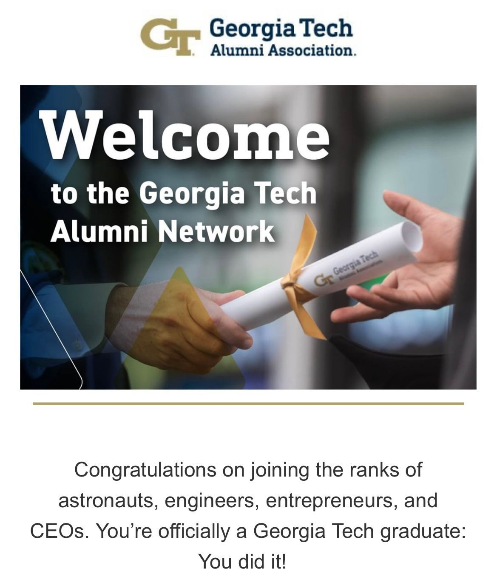

--- 
title: "Reflections on Completing my Master's in Analytics at Georgia Tech"
date: 2023-05-12T22:15:00
draft: false
description: "Key insights and takeaways from my 2.5-year journey in the Master's in Analytics program at Georgia Tech."
topics: ["career-advice", "data-science", "opinion"]
---

🎓📚 As of today, I've concluded a significant chapter of my academic journey - completing my Master's in Analytics from Georgia Tech. Initiated in the spring of 2021, this 2.5-year journey has been filled with countless hours of study, numerous moments of revelation, and invaluable learning.

Three key insights that stand out from this program are:

1️⃣ The complexity of real-world analytics problems often needs the integration of multiple models - a principle aligning with the single responsibility concept in software development. This understanding has helped me approach problem-solving more effectively.

2️⃣ Machine or deep learning isn't always the answer. The core of problem-solving lies in understanding the appropriate analytics principles and relevant domain expertise. Courses like Deterministic Optimization and Simulation have been instrumental in shaping this perspective.

3️⃣ In the fast-paced world of analytics, the importance of fundamental concepts like calculus, statistics, and linear algebra cannot be overstated. These are the building blocks of various algorithms. As new algorithms are continually developed, a solid grasp of these foundational principles helps us better understand and adapt these emerging tools to specific real-world scenarios. In other words, understanding the basics is our key to keeping up with the ever-evolving field of analytics.

As I step into the next phase of my journey, I am enthusiastic about applying these insights alongside my software and petroleum engineering skills. I aim to contribute to the development of efficient workflows and help tackle intricate problems.

This accomplishment wouldn't have been possible without the support of my family, friends, and faculty at Georgia Tech. Thank you!

#Analytics #MachineLearning #GeorgiaTech #Graduation #MastersDegree #DataScience #OperationsResearch


