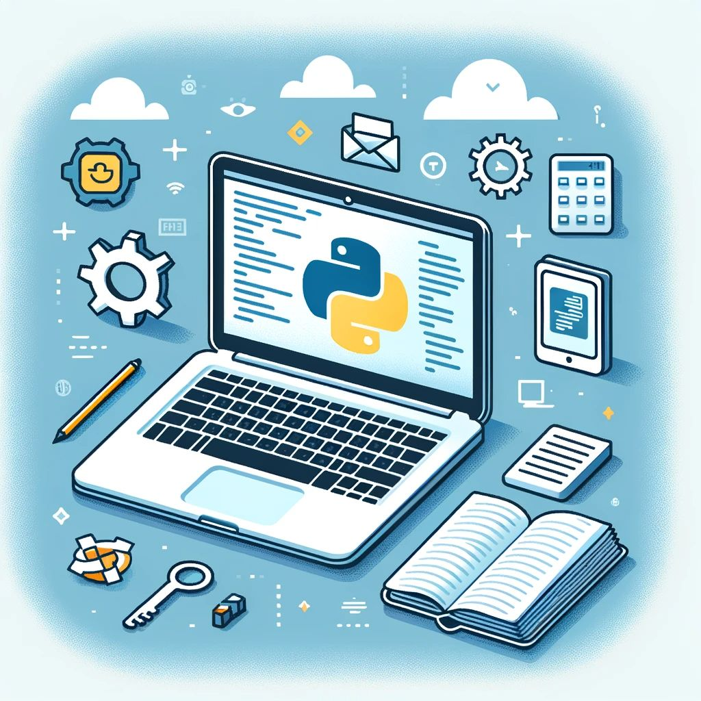

--- 
title: "5 Compelling Reasons for Engineers to Start Programming"
date: 2023-12-07T18:00:00
draft: false
description: "Exploring how programming can empower engineers through automation, better communication, and new career opportunities."
topics: ["career-advice", "beginner-friendly", "programming"]
---

Should you dive into programming?

Here are 5 reasons to consider it: 

...

1. Sharing.

You possess valuable skills and expertise in your field that deserve to be shared. Programming empowers you to package your knowledge into a user-friendly app, enabling you to reach a wider audience.

2. Automation.

You have repetitive tasks that you want to automate and might go beyond using an Excel workbook. Although some excellent low/no-code alternatives (like Zapier) exist, you might need programming to automate specialized knowledge such as equations and workflows.

3. Learning.

You enjoy being hands-on and learning the inner workings of an existing app or process in your domain. You could replicate literature processes or existing app results with programming.

4. Communication.

You work in a team that requires communicating with software developers. This is also true for most cross-domain interactions as part of your day-to-day activities.

5. Remote work.

Finally, learning to code can increase your chances of remote work and offer more flexibility due to automation benefits and the history of remote work among programmers (one critical skill here is version control)

Want to try programming? Python is a good fit for most domains. We will talk more about it and how you can leverage it to learn programming, all the way up to developing a complete application you can share with others. 


