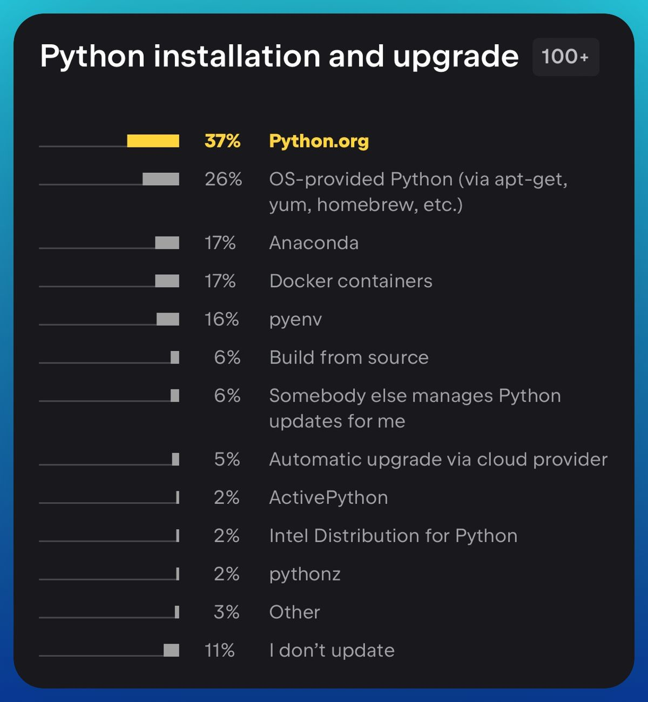

--- 
title: "Better Ways to Install Python: Anaconda, Replit, and Beyond"
date: 2023-12-11T18:07:00
draft: false
description: "Comparing different Python installation methods and tools like Anaconda and Replit to help you choose the right setup for your needs."
topics: ["python", "beginner-friendly", "tutorial"]
---

The most popular way to install Python is from python.org*.

However, there are a few things to consider (plus some of my favorite alternatives).

If you're starting with Python, you'll have to deal with:

1. Library installation.
2. Familiarize yourself with an IDE**.

If you've been using Python for a while, you're likely aware of the significance of creating virtual environments for your projects.

- They help prevent conflicts between different packages.
- They ensure the creation of reproducible Python projects.

If this situation applies to you, here are some installation alternatives to make your Python journey more enjoyable:

- 🐍 Anaconda (local)
- ☁️ Replit (cloud)
- 🎁 Bonus (local)

🐍 Anaconda:

A comprehensive package for data analysis with pre-installed libraries. It includes Anaconda Navigator for creating environments and installing libraries quickly.

Check it out: https://www.anaconda.com/

However, you should be aware of some conditions. If you intend to use Anaconda in a commercial environment, such as on your company-assigned computer, you may be required to pay for it.

For more information, please visit: https://lnkd.in/gX-iy5Tc

---------------------------------------------------

☁️ Replit :

Replit is a cloud-based development environment for coding, collaboration, and deployment. It eliminates the need for complex local setups and enables effortless collaboration.

Check it out here: replit.com

This service offers free access to a 0.5 vCPU and 512 MB of RAM. There are no limits on how much you can use per month. While the base computing power may be limited, it should suffice for exploring the basics of Python and even developing some web applications.

-------------------------------------------------

When I started learning Python 7 years ago, I aimed to understand how it could help me move from point A to point B. Applying knowledge to daily work is crucial in learning new skills.

Let's dive into that next time. 💪🔍

And how about you? What tools have you used to get started with Python? What are you currently using??

*Source: Python Developers Survey 2022 Results (jetbrains.com) - https://lnkd.in/g8Bx5dJh

**Note: The official Python installation already includes a basic IDE called IDLE.


