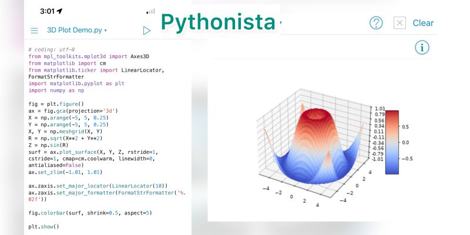

--- 
title: "Coding on the Go: Best Mobile Apps for Learning Python and Git"
date: 2023-12-18T23:00:00
draft: false
description: "Turn your social media time into learning time with these top-rated mobile apps for Python development and version control."
topics: ["python", "mobile", "tips"]
---

On average, we spend about two hours per day on social media using our phones. Imagine if you could dedicate just 15 minutes of that time to learning and mastering programming.

Here are some iOS apps that allow you to code directly on your phone

1. Pythonista.

Comprehensive IDE for Python. Write, run, test, and debug Python code on mobile devices.

Key features:
- Syntax highlighting
- Powerful interactive interpreter console
- Includes  pandas, matplotlib, among others

2. Juno.

This app allows you to create, edit, and run Jupyter notebooks on your mobile device.

Key features:
- Beautiful notebook interface.
- Nice package manager. You can install other pure Python libraries.
- It includes SciPy, scikit-learn, and even GeoPandas.

3. Working Copy.

Git for iOS. Seamlessly handle repositories with a mobile-ready interface. Key features include commit, merge, checkout branches, and syncing with your GitHub account.

The above apps are not free, but there are alternatives to the first two. 

Free options
- a-Shell (shell with Python - you can run .py scripts here)
- Carnets (Jupyter notebooks)

No more excuses, ditch TikTok and code with these apps instead.


