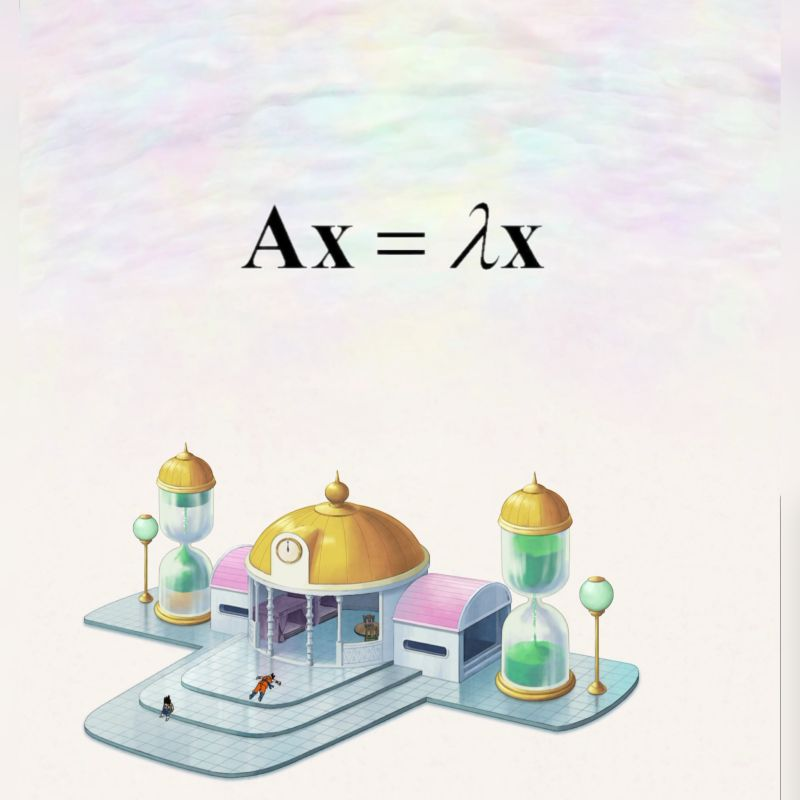

--- 
title: "Dragon Ball Z and Linear Algebra"
date: 2023-12-27T18:00:00
draft: false
description: "How these two seemingly unrelated subjects made sense to me."
topics: ["linear-algebra", "machine-learning", "opinion"]
---

During my first year of college, I enrolled in Linear Algebra. The professor dove right into discussing n-dimensional vector spaces, and I found these concepts to be incredibly abstract at the time. 

In fact, one of my classmates admitted to picturing himself in the Hyperbolic Time Chamber from Dragon Ball Z whenever he heard about anything related to n-dimensional stuff. 🕰️🐉

I didn't know that these concepts would resurface repeatedly, especially when I started my first machine learning course back in 2016 and later during my Masters program.

It's almost magical how concepts like eigenvalues and eigenvectors serve as the foundation for practical tools such as Principal Component Analysis (PCA).

While you don't necessarily need to understand these concepts to run code like:  
—————————————————
from sklearn.decomposition import PCA 

X_reduced =PCA(n_components=3).fit_transform(X) 
—————————————————

Having that understanding definitely enhances intuition and keeps you up-to-date with new methods being published. 

Plus, it adds a whole new level of enjoyment to rewatching Dragon Ball Z in my case. 😅

Is there a college subject that you thought (or wished) you would never have to deal with again, but it turned out to be the complete opposite?


