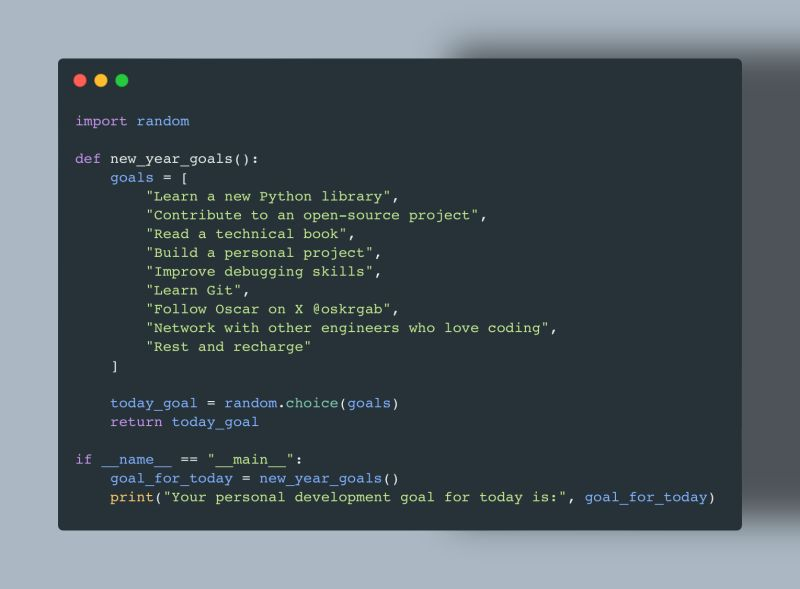

--- 
title: "Pythonic New Year's Resolutions for 2024"
date: 2024-01-01T19:00:00
draft: false
description: "Kick off 2024 with a quick Python tip on using random.choices for prioritizing your goals."
topics: ["python", "tips"]
---

What better way to kick off 2024 than with a list of New Year's resolutions? Happy 2024, everyone!

💡 Tip: If you want to assign different weights to each goal, consider using random.choices instead. 🤓

#happy2024 #Python


