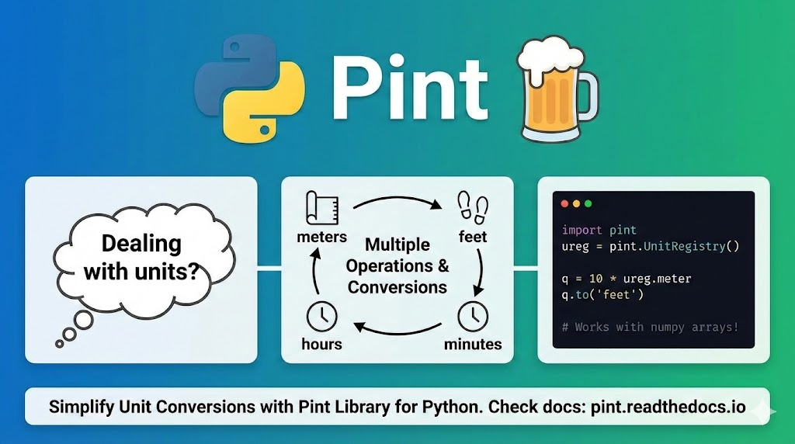

--- 
title: "Simplify Unit Conversions in Python with Pint"
date: 2024-01-03T19:00:00
draft: false
description: "Stop manually converting units. Learn how Pint makes handling physical quantities and conversions effortless in Python."
topics: ["python", "units", "tips"]
---


Dealing with units may seem trivial, but what if you have multiple operations and need to convert between different units? Let this library handle it for you.

If you're using #Python, you'll be happy to know that a library is designed for this purpose called **Pint** 🍺.

Pint is a powerful library that allows you to define, operate, and manipulate physical quantities effortlessly. It simplifies the process of defining the units for your quantities and even works seamlessly with numpy arrays!

In case the unit you are working with is not available by default, you can easily define it in a simple .txt file using the following syntax:

```
hour = 60 * minute = h = hr
minute = 60 * second = min
```

For a deep dive into this library, check out the documentation here: https://pint.readthedocs.io/



