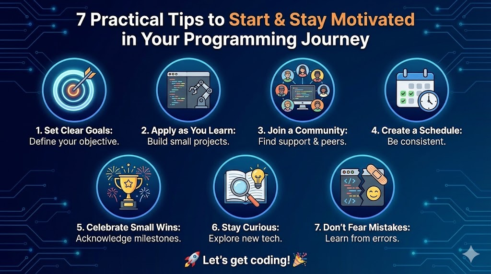

--- 
title: "7 Practical Tips to Start and Stay Motivated in Your Programming Journey"
date: 2024-01-11T18:18:00
draft: false
description: "Guidance for engineers and non-CS professionals on setting goals, applying knowledge, and building consistent coding habits."
topics: ["career-advice", "beginner-friendly", "tips"]
---

Are you struggling to start programming or having trouble finding the motivation to keep coding?

Many people start with online courses. E.g., those interested in Python often start with a course on the basics, covering topics like variables, functions, and data structures.

This approach is great as long as you know why you want to learn coding in the first place. Otherwise, you may accumulate courses and certifications that you never actually put into practice.

This is especially important for engineering and non-CS individuals, as their daily work or college degree may not require frequent coding.

Here are some tips to help you start and not lose traction:

1. Set Clear, Achievable Goals:

Could you define what you want to achieve with coding? Is it to automate a specific task in your job? To build a personal project? Or to transition into a tech role? Clear goals keep you focused.

2. Apply as You Learn:

Don’t just watch tutorials - apply what you learn. Try coding small projects or scripts relevant to your field. This practical application reinforces learning and keeps it interesting.

3. Join a Community:

Being part of a coding community can be incredibly motivating, whether in online forums, local meetups, or study groups. You'll find support, inspiration, and maybe even collaborators for projects.

4. Create a Learning Schedule:

Consistency is key. Carve out regular time slots in your week dedicated to coding. This helps build a habit, making it easier to stay on track.

5. Celebrate Small Wins:

Completed a tricky module? Wrote a script that saved time at work? Celebrate these milestones! They are proof of your progress and will keep you motivated.

6. Stay Curious:

Always be open to learning. Explore new languages, frameworks, or methodologies. The tech field is dynamic, and staying curious will keep your journey exciting.

7. Don’t Fear Mistakes:

Programming is as much about solving problems as it is about writing code. Mistakes are inevitable and are valuable learning opportunities. Embrace them.

--

Remember, the coding journey is unique for everyone, especially if combined with another field like engineering. Stay patient, stay persistent, and most importantly, have fun!

Let’s get coding 🎉 !


