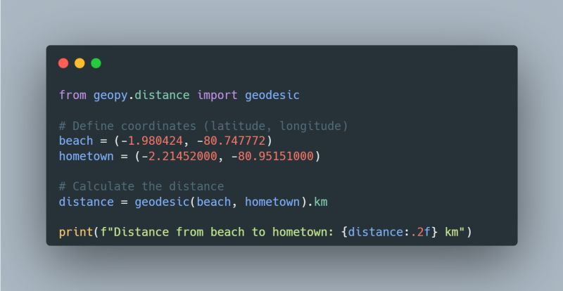

--- 
title: "Calculating Geographical Distances in Python with GeoPy"
date: 2024-01-12T18:44:00
draft: false
description: "Learn how to use the geopy library for geocoding and calculating distances between locations using different geodesic models."
topics: ["python", "tutorial"]
---

Today, I was feeling a bit homesick and remembering how great it is to spend some time on the beach and close to home.

On a great day, I could actually see my hometown, Salinas, from my favorite beach, Ayangue, even though it is a one-hour drive to get from one to the other.

Then I wondered, what is the actual distance between these two points?

I started looking up a Python library to quickly do the calculation and stumble upon #geopy

This library has great features such as geocoding and calculating distances; it can even use different geodesic models besides the WGS-84 ellipsoid.

Check out the code snippet below to see how I calculated the distance between my two favorite locations on Earth. 

It might be useful to you if you need it for other purposes 😜.


