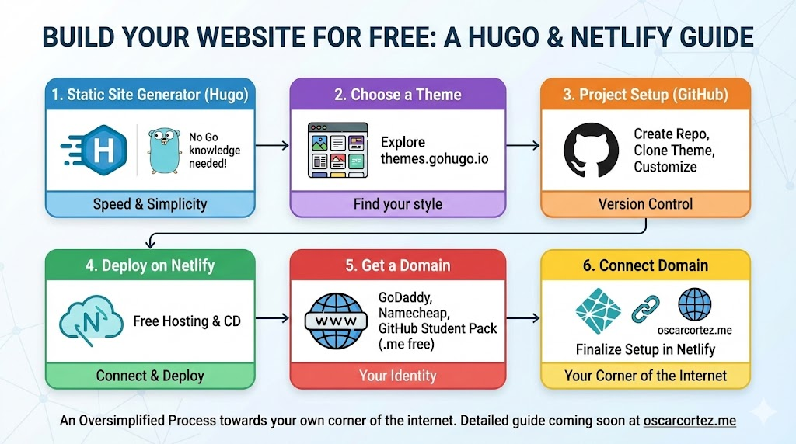

--- 
title: "Building Your Own Website for Free: A Step-by-Step Guide with Hugo"
date: 2024-01-14T18:50:00
draft: false
description: "Learn how to create, customize, and deploy your own website using static site generators and free hosting services like Netlify."
topics: ["web-development", "git", "tutorial"]
---

🌐 Have you ever wondered how you could take part in a tiny piece of the internet?

Sure, you have a LinkedIn account, Instagram, and maybe a blogging site, but how about creating your website?

Creating your website is an incredibly rewarding process to understand more about how the internet works. The best part is that you might do it entirely for FREE (at least for the first year if you are a student)

Here is a summary of the process I did to create my website: oscarcortez.me

1️⃣ Use a static site generator.

I used HUGO. It's a popular static site generator written in Golang. But don't worry, you don't need to know Golang to create your site.

2️⃣ Find a theme you like.

You can check out some here: https://themes.gohugo.io/

3️⃣ Setup your project.

- Start a GitHub repo

- Clone the theme repo as a submodule

- Start customizing your site

4️⃣ Deploy in Netlify.

Netlify offers free hosting for static websites. You can connect your GitHub repo to Netlify to update your site every time you commit changes to the branch you selected.

5️⃣ Get a domain.

You can use several sites to buy a domain like GoDaddy or Namecheap, although the latter will give you a .me domain for free if you are enrolled in the GitHub Student Pack.

6️⃣ Go back to Netlify and connect your new domain.

—————-

This process is of course oversimplified but I plan to write a detailed article @ oscarcortez.me

Even though creating a website does not have much to do with engineering itself, it is a great way to understand how the web works, and have something you made yourself out there, in your own domain.

It's like having your own kiosk in the biggest and most popular city.

How did you create your website? Are you planning to create it? If you already have one feel free to share below 👇.


