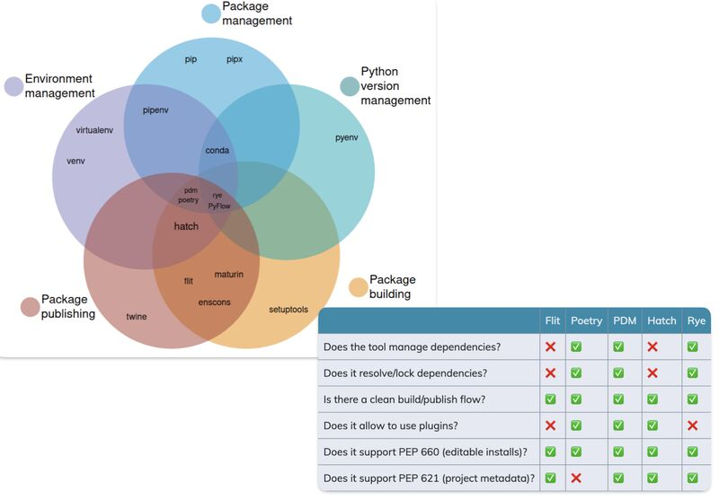

--- 
title: "Navigating Python's Ecosystem of Virtual Environments and Package Managers"
date: 2024-01-20T18:40:00
draft: false
description: "Understanding the different tools available for managing Python projects, from Poetry and pyenv to newer options like Rye."
topics: ["python", "tutorial"]
---

Python newcomers often find themselves confused with virtual environments and project configurations since it has a plethora of options to handle these tasks, as opposed to other languages such as Rust’s cargo.

In the post below, Maria has created excellent visuals to help us understand these categories better. 

Personally, I have been using Poetry + pyenv for a while now, but I'm always open to new experiences. Recently, I stumbled upon "rye," and it seems to be an exciting new tool that allows you to handle different Python versions as well. 

So, if you're looking to spice up your Python experience, give these tools a try. But remember, if you already have a tool that works for you, master it, develop it, and deploy. Don't get distracted by the latest shiny stuff out there unless it adds significantly more value that what you already have.


