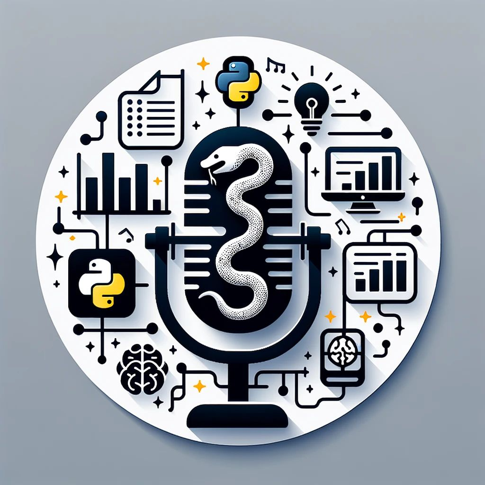

--- 
title: "Top Podcasts for Learning Python, Data Science, and Software Engineering"
date: 2024-01-21T14:30:00
draft: false
description: "A curated list of my favorite podcasts to stay updated and inspired in the world of programming and data analytics."
topics: ["opinion", "podcast"]
---

Listening to music while commuting or relaxing is enjoyable. However, if you're looking for new and exciting content, I highly recommend exploring podcasts. Specifically, podcasts that delve into Data Science, Python, and programming in general.

Here are my favorite podcasts in these areas:

🐍 Python:

- The RealPython Podcast
🔗 https://realpython.com/podcasts/rpp/

- Talk Python to Me
🔗 https://talkpython.fm/

- Python Bytes
🔗 https://pythonbytes.fm/

- The Python Show
🔗 https://www.pythonshow.com/

📊 Data Science:

- Super Data Science Podcast
🔗 https://www.superdatascience.com/podcast

- Data Science at Home
🔗 https://datascienceathome.com/

- Data Skeptic
🔗 https://dataskeptic.com/

💻 Programming and Software:

- CodeNewbie
🔗 https://www.codenewbie.org/podcast

- Software Engineering Daily
🔗 https://softwareengineeringdaily.com/

- Compiler
🔗 https://www.redhat.com/en/compiler-podcast

—————————-

I'm sure you have some amazing podcasts to recommend too! Feel free to share them in the comments below.👇


