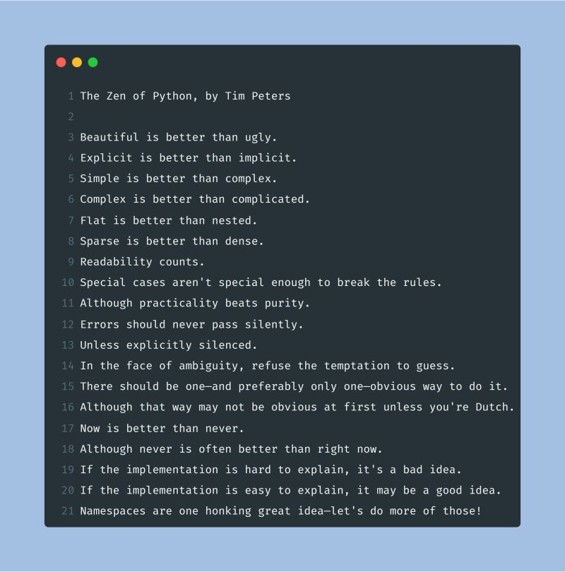

--- 
title: "What does it mean that a code is Pythonic?"
date: 2024-01-22T18:52:00
draft: false
description: "Understanding the philosophy of 'Pythonic' code and how following the Zen of Python can improve your projects and growth as a programmer."
topics: ["python", "best-practices", "beginner-friendly"]
---

If you are starting in #Python programming, you might come across the term "Pythonic". But what does it mean?

Writing Pythonic code means following the principles of the Zen of Python, which emphasize readability, simplicity, and explicitness. It is about writing clear, concise, and efficient code that aligns with Python's ethos.

Here are the benefits of writing Pythonic code:

📖 Readability: It makes the code more accessible and easier to maintain.

⚡ Efficiency: It optimizes the performance and requires less code.

🌎 Community cohesion: It aligns with global Python practices.

✨ Elegance: It helps solve complex problems creatively and efficiently.

Therefore, as you continue your Python journey, remember that being Pythonic is not just about writing code; it is about adopting a philosophy that makes your code more effective, your projects more successful, and your growth as a programmer more fulfilling.

If you want to summon the Zen of Python, just type the following in a Python console: `import this`.

Feel free to share your experiences or questions about writing Pythonic code in the comments below!👇


