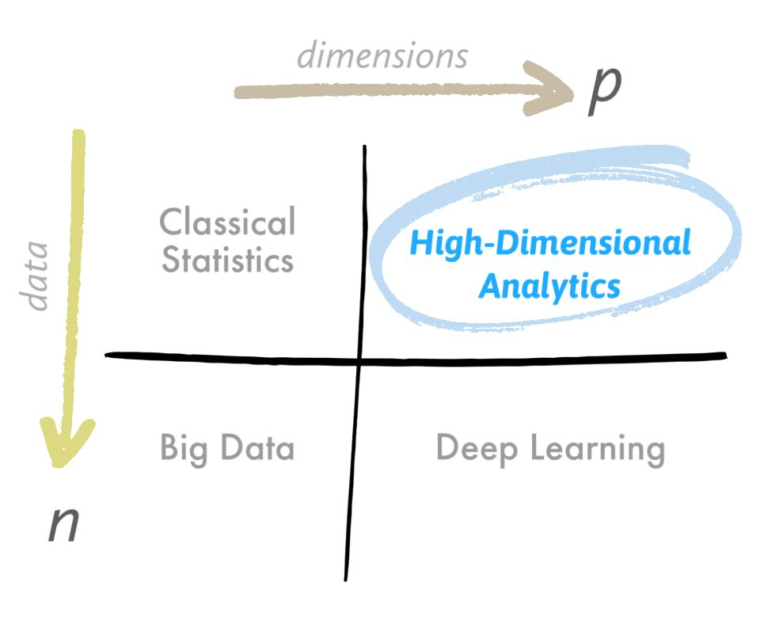

--- 
title: "High-Dimensional Analytics: Overcoming the Curse of Dimensionality"
date: 2024-01-23T18:00:00
draft: false
description: "Strategies for working with functional data and high-dimensional features when observation counts are low, using methods like Functional PCA."
topics: ["machine-learning", "data-science", "tutorial"]
---

Do you have high-dimensional data with few samples and want to use it in a machine-learning model? 📊

If you use the data as it is, you'll likely face the curse of dimensionality. This means that the volume of the observation space increases exponentially when we add more dimensions to it. 😱

This has unwanted consequences such as overfitting and, thus, performance degradation of some ML models. 😕

As engineers, you might encounter this type of information in many places, such as:

-📡Multi-channel signals (e.g., EEG signals, sensor information of mechanical unit, etc.)
- 🖼️ Images
- 🌫️ Point Clouds (e.g., 3D models, laser scans or LiDAR)

The above are examples of what is called "Functional Data." This data type can be defined as a changing value or signal that carries information and is often expressed as a function of time or space.

One way to address these problems is with High-Dimensional Analytics (HDA).

HDA methods try not only to reduce the dimensions through methods like PCA but aim to learn the low-dimensional structure of the high-dimensional observation. These methods are useful when we have many features or dimensions but relatively scarce observations. 🧩

Here are some methods that help with this low-dimensional learning:

• B-splines
• Tensor Decompositions
• Functional PCA
• Matrix Completion

Would you like to learn how to apply these methods in Python? If so, please let me know in the comments which method you're interested in!


