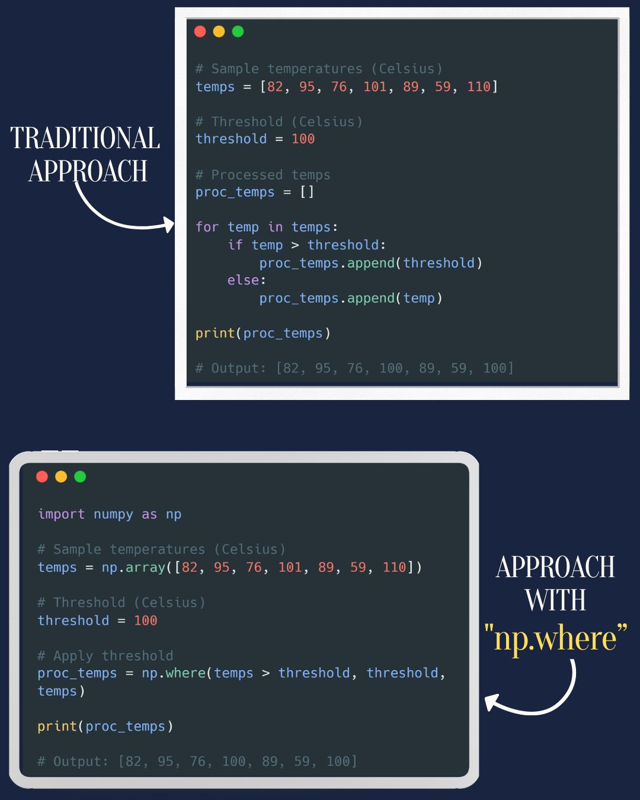

--- 
title: "NumPy Quick Tip: Conditional Selection with np.where"
date: 2024-01-24T19:01:00
draft: false
description: "Learn how to use NumPy's versatile np.where function for efficient array manipulation and conditional element replacement."
topics: ["python", "numpy", "tips"]
---

🐍 Python Quick Tip! This time using numpy🚀

Let's talk about `np.where`, a powerful yet often underappreciated function in NumPy. It's incredibly versatile for conditional selection and array manipulation.

Here's a neat trick combining `np.where` with broadcasting to solve a common problem: replacing elements in an array based on a condition. 💡

Check it out! 👇


