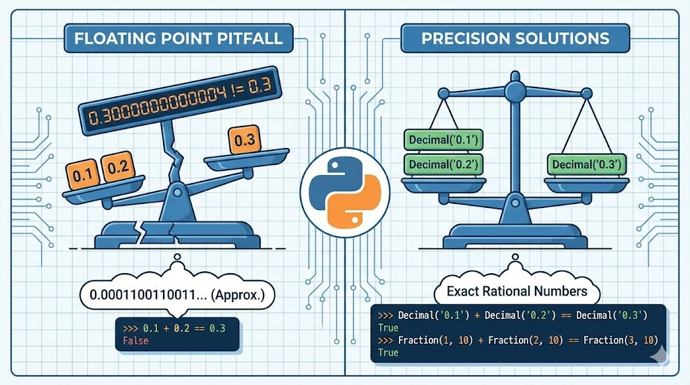

--- 
title: "Understanding Floating Point Arithmetic Pitfalls in Python"
date: 2024-01-26T18:17:00
draft: false
description: "Why 0.1 + 0.2 doesn't equal 0.3 in most programming languages and how to handle precision using Python's Decimal and Fraction modules."
topics: ["python", "data-science", "tutorial"]
---




If you've been using Python for data analysis, you might have encountered a result that seems to defy basic math. Try running this in your console:

```python
>>> 0.1 + 0.2 == 0.3
False
```

It's a classic "gotcha" for self-taught programmers. But why is it False? If you run the same comparison with integers, it works exactly as expected:

```python
>>> 1 + 2 == 3
True
```

The reason lies in how computers handle numbers under the hood: **Floating Point Arithmetic.**

### The Binary Fraction Problem

Computers represent numbers using binary (base 2). While integers are easy to convert to binary, fractions are much trickier. 

A number like 0.1 is a simple decimal fraction, but in binary, it becomes an infinitely repeating fraction: `0.000110011001100110011...`

Because computers have finite memory and precision, they must eventually "cut off" this sequence. This results in a tiny approximation error. When you add 0.1 and 0.2, those tiny errors accumulate, meaning the result is *almost* 0.3, but not exactly. 

This isn't a Python bug—it's a fundamental property of how double-precision floating-point numbers work in almost every programming language (following the IEEE 754 standard).

### A Real-World Engineering Example

I first encountered this behavior years ago while building relative permeability tables for reservoir simulation. I was using a script to populate values between a starting water saturation \\(S_{wirr}\\) and a residual oil saturation \\(1 - S_{or}\\). 

In the O&G industry, values like 0.1, 0.2, and 0.3 are common for these parameters. My script was failing to generate values in the correct places because I was performing direct comparisons like `if saturation == 0.1:`. Because of floating-point inaccuracies, the comparison would occasionally fail even when the math "should" have been correct.

### How to Handle Precision

If you are performing critical engineering calculations or financial transactions where every decimal place counts, you shouldn't rely on standard floats. Instead, look into Python's built-in modules designed for precision:

*   **Decimal Module:** Provides support for fast correctly rounded decimal floating point arithmetic. [Official Documentation](https://docs.python.org/3/library/decimal.html)

*   **Fractions Module:** Allows you to perform arithmetic using rational numbers (fractions) to maintain absolute precision. [Official Documentation](https://docs.python.org/3/library/fractions.html)

For more details on why this happens, I highly recommend reading the official Python tutorial on [Floating Point Arithmetic: Issues and Limitations](https://docs.python.org/3/tutorial/floatingpoint.html).

Have you run into these "phantom" errors in your own scripts? How did you solve them?

