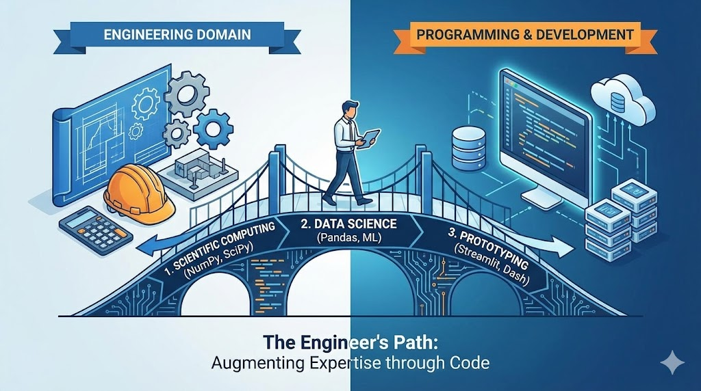

--- 
title: "The Engineer's Path to Programming: Science, Data, and Prototypes"
date: 2024-01-28T19:59:00
draft: false
description: "How the journey into software development differs for domain experts who use coding to augment their engineering expertise."
topics: ["career-advice", "opinion", "python"]
---

Bridging Gaps: The Unique Path of Engineers in Learning Programming.

As engineers, whether mechanical, civil, electrical, or petroleum, our journey into the world of programming is different, especially when we aim to augment our domain expertise rather than pivot careers entirely. Here's a perspective on how our programming path diverges from that of dedicated software developers:

1️⃣ The Role of Programming: 

For many engineers, programming is an optional tool, not a necessity. We often rely on applications like Excel or specialized software specific to our fields. Unlike developers, our core work doesn't mandate coding, which sometimes diminishes the immediate drive to learn it. However, when we do turn to programming, it's primarily to streamline and innovate our existing processes, aiming for efficiency and automation.

2️⃣ Scientific Computing vs. Software Development: 

Our academic foundations in calculus, physics, and numerical analysis nudge us towards scientific computing rather than pure software development. While engineers often seek to implement and solve domain-specific equations using libraries like NumPy, SciPy, or SymPy in Python, software developers dive deep into computer architecture, algorithms, data structures, and more, mastering languages like Java or C++.

3️⃣ Embracing Data Science for Complex Phenomena: 

When the complications of physical phenomena elude us, or when models become too complex, we turn to data science and analytics. This shift is fueled by the need to manage and interpret the vast data generated by modern equipment, driving many engineers towards programming languages like Python and R for data processing, insights generation, and even machine learning model development. This is one of the reason why many engineers started learning in programming the last few years.

4️⃣ Prototype vs. Full-fledged Application: 

Engineers excel at conceptualizing and creating working prototypes, harnessing our domain expertise and programming skills. Tools like Streamlit, Gradio, or Dash enable us to rapidly visualize our solutions. However, transforming these prototypes into robust, user-ready applications demands a deeper dive into software development, addressing aspects like user scalability, architecture, CI/CD pipelines, and ongoing maintenance.

In conclusion, programming offers a powerful avenue for engineers to elevate their careers, providing tools to innovate and solve domain-specific challenges more efficiently. For those embarking on this journey, a focus on scientific computing and data manipulation can be particularly beneficial. 

And remember, if your project evolves from a concept to a solution, collaborating with software developers can ensure that your application is not just built, but built to last. This synergy between engineering prowess and software development is not just beneficial but essential in today's tech-driven landscape.

What do you think? Share in the comments 👇


