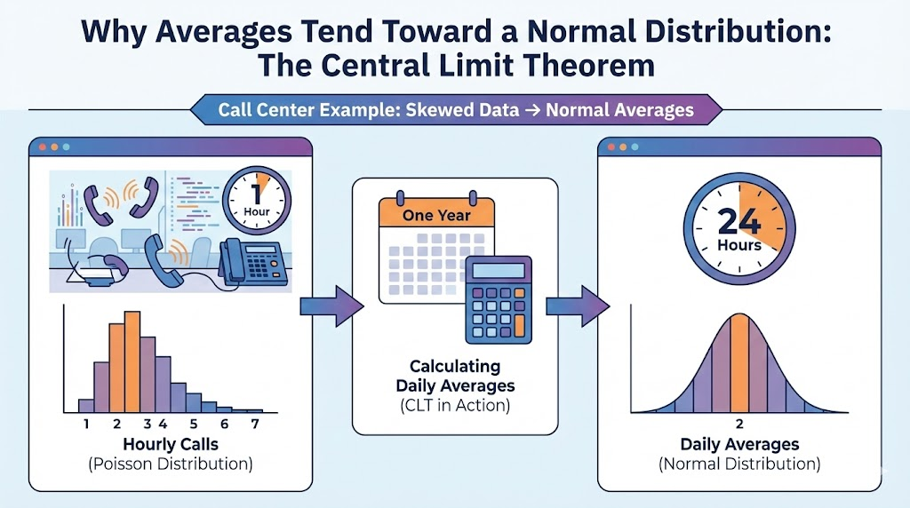

--- 
title: "Statistics Deep Dive: Why Averages Tend Toward a Normal Distribution"
date: 2024-02-02T19:17:00
draft: false
description: "Explaining the Central Limit Theorem through a practical call center example and showing its impact on data analysis."
topics: ["python", "statistics", "tutorial"]
---




Have you ever wondered why the **Normal Distribution** (the famous bell curve) appears so frequently in nature and business? Even when the underlying data is skewed or follows a completely different pattern, the *averages* of that data often behave in a very predictable way.

This phenomenon is driven by one of the most important concepts in statistics: the **Central Limit Theorem (CLT)**.

### The Scenario: Call Center Arrivals

Imagine a customer service center where the arrival of calls follows a **Poisson distribution** \\(\lambda=2\\). This means that, on average, 2 calls arrive per hour.

Individual hours are unpredictable—you might get 0 calls, 1 call, or occasionally a spike of 5 or 6. The Poisson distribution is inherently skewed; it doesn't look like a bell curve. However, if the manager records the number of calls every hour and calculates the **daily average** (across 24 hours), something magical happens over time.

### Why the CLT Matters

The Central Limit Theorem states that if you take sufficiently large random samples from any population with a finite variance, the distribution of the sample means will be approximately normal, regardless of the shape of the original population distribution.

In our call center case, the CLT applies because:

1.  **Large Sample Size:** By recording hourly calls over a year, we accumulate a massive amount of data points.
2.  **Independence:** Each call arrival is independent of the others.
3.  **Random Sampling:** The samples are drawn randomly from the continuous stream of arrivals.

### Seeing it in Action with Python

We don't have to take our word for it—we can simulate this in Python. By generating Poisson-distributed data and then plotting the distribution of their means, the bell curve emerges clearly.

```python
import numpy as np
import matplotlib.pyplot as plt

# Parameters
lam = 2          # Average calls per hour
hours_per_day = 24
days = 365       # One year of data

# Simulate hourly arrivals for 365 days
# This creates a 365x24 matrix
hourly_calls = np.random.poisson(lam, (days, hours_per_day))

# Calculate the daily average for each day
daily_averages = hourly_calls.mean(axis=1)

# Plotting
plt.figure(figsize=(10, 6))
plt.hist(daily_averages, bins=30, density=True, color='skyblue', edgecolor='black', alpha=0.7)
plt.title(f'Distribution of Daily Average Call Arrivals ({days} Days)')
plt.xlabel('Average Calls per Hour')
plt.ylabel('Frequency')
plt.grid(axis='y', alpha=0.3)
plt.show()
```

### The Result: From Skewed to Bell-Shaped

While the individual hourly counts follow a Poisson distribution, the **daily averages** quickly lose that skewness. As you average the counts over 24 hours, the extreme highs and lows cancel each other out, and the resulting distribution centers around the mean \\(\lambda=2\\), forming a classic Normal Distribution.

This is the "magic" of the CLT. It allows analysts and engineers to apply statistical techniques that assume normality (like many types of hypothesis testing and regression) to real-world processes that are originally non-normal.

