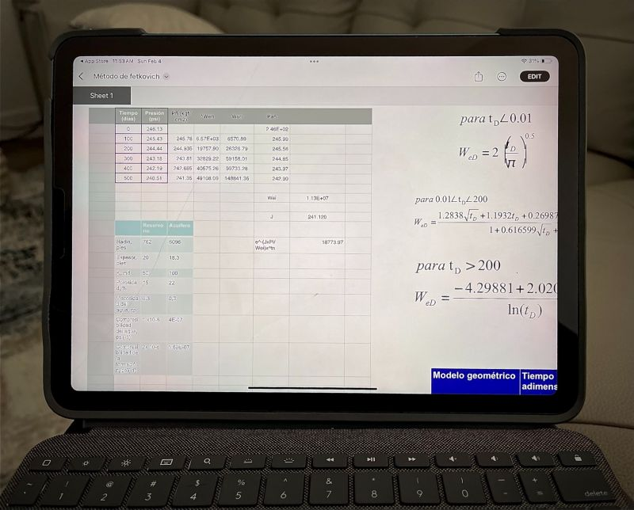

--- 
title: "Unlocking the Value of Your Professional Excel Archives"
date: 2024-02-04T18:12:00
draft: false
description: "Reflecting on the long-term utility of Excel files as personal archives and why augmenting them with programming can boost productivity."
topics: ["excel", "career-advice", "opinion"]
---

The ever-increasing vault of experience… And Excel files.

During college, I chose Matlab as my primary programming language and simultaneously embarked on Objective-C to develop iOS apps. Back then, I seldom used #Excel. This changed when I started my career.

As a petroleum #engineer, I would not code every day 🧑‍💻, but if there was a tool I used daily, it was Excel. It's so easy to start writing formulas and seeing results immediately that it is a no-brainer for almost any task. As you know, having many of these files on your computer is common. 

These countless, large, and scattered Excel files form a digital archive of your experience and how these workflows make sense to you while you were solving such problems. How valuable do you think those Excel files are? I believe they are priceless.💎

Because of this, I've come to identify three long-term uses for these files. The last one is divided into four additional related usages.

1. Personal reference. Opening these files every once in a while. Sometimes, after years.

2. Cold storage. Files were never opened again after their first or second use.

3. Personal productivity ecosystem 📈. When iterating over a file many times, you've almost built a full-fledged application. You use this almost on a daily or weekly basis.

-> 4.1. Mentoring. Teach younger engineers the steps behind a workflow.
-> 4.2. Not sharing it with anyone else because it took years of blood, sweat, and tears to come up with it. 😩
-> 4.3. Built a company around it, perhaps creating a desktop or web app.
-> 4.4. Your employer leverages those files and your experience to enhance their existing products. 

The common problem with Excel files is that it's difficult to understand another person's Excel file. It lacks cell-by-cell version control. And it's hard to repurpose or extract the functionality of an existing Excel file.

As such, if you have some time, learn an easy-to-understand programming language for data analysis (e.g., #Python 🐍 / R) so you can use Excel and your programming skills to record your ever-growing breadth of knowledge. It'll be easier to repurpose it for another thing in the future, and if you properly document it through Git, it will be easier to understand why you made some decisions back then.

If you don't have the time to learn a new language and are too busy to make the most of your Excel files, try sharing or mentoring others. When you share your knowledge, you never know what new ideas will come, and you become the point of reference for such a subject.

If you are a company, make sure to ping these experienced professionals. It doesn't matter if they are not developers, but chances are they have decades of knowledge embedded in Excel files that could enhance your company-wide workflows. Never forget to acknowledge their contribution in any way they see fit 😉

How about you? What's your experience with Excel files? Share your thoughts below 👇


