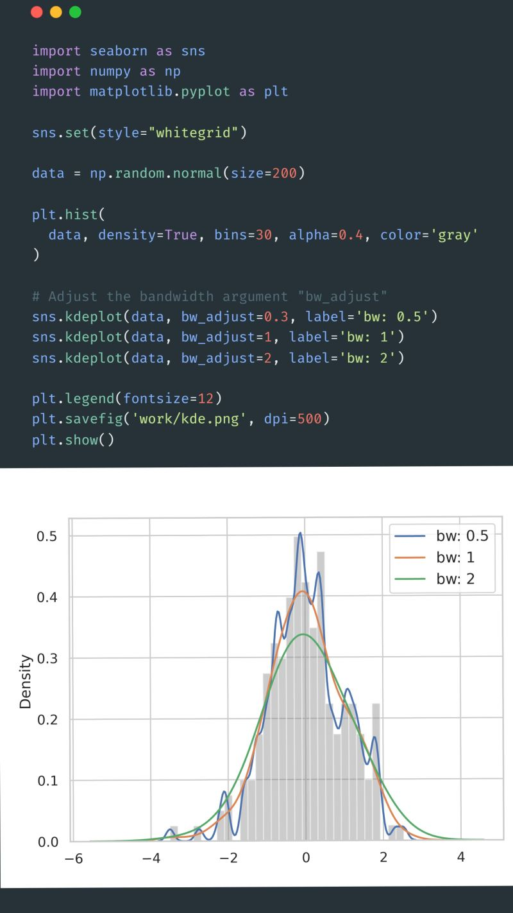

--- 
title: "Mastering Kernel Density Estimation (KDE) in Seaborn"
date: 2024-02-05T18:20:00
draft: false
description: "Go beyond histograms and learn how to use KDE plots to uncover the true underlying density and structure of your data."
topics: ["python", "data-visualization", "tutorial"]
---

📊 𝐊𝐃𝐄𝐬 𝐢𝐧 𝐒𝐞𝐚𝐛𝐨𝐫𝐧 𝐟𝐨𝐫 𝐃𝐚𝐭𝐚 𝐕𝐢𝐬𝐮𝐚𝐥𝐢𝐳𝐚𝐭𝐢𝐨𝐧.

When I started using Kernel Density Estimation (KDE) in Seaborn, they appeared to be a polished alternative to histograms. However, KDE's capacity to reveal data structures is very robust.
KDE employs a sum of Gaussian distributions for each data point, crafting a smooth, continuous curve that uncovers the actual density of the data.

𝐖𝐡𝐲 𝐮𝐬𝐞 𝐊𝐃𝐄?

• It provides a seamless view, portraying the data's distribution with greater fidelity than histograms.
• It's invaluable for identifying subtle data structures, modes, and outliers.

𝐌𝐚𝐬𝐭𝐞𝐫𝐢𝐧𝐠 𝐭𝐡𝐞 𝐁𝐚𝐧𝐝𝐰𝐢𝐝𝐭𝐡 (𝐛𝐰):

• The `bw_adjust` parameter controls the curve's smoothness.
• A higher `bw_adjust` smoothens the curve, ideal for a broad overview.
• A lower `bw_adjust` reveals finer details, which may also introduce noise.

Through trial and error with bw_adjust, you can balance detail and smoothness, fine-tuning your KDE plots for more precise insights. A histogram overlay allows for a direct visual comparison, emphasizing KDE plots' smoother and more informative nature.

Feel free to comment on your thoughts about this plot and how you've used it before!

#DataVisualization #Seaborn #KDE #Python #DataScience


