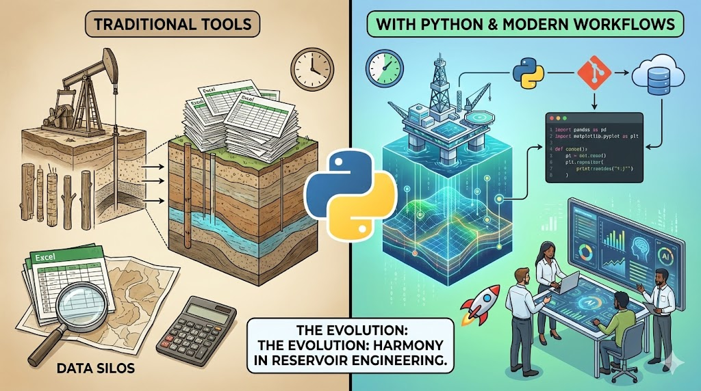

--- 
title: "The Evolution of Reservoir Engineering with Python"
date: 2024-02-09T00:02:00
draft: false
description: "Exploring how modern programming enriches traditional engineering tools to optimize reservoir performance and recovery."
topics: ["python", "oil-and-gas", "opinion"]
---

𝐄𝐯𝐨𝐥𝐯𝐢𝐧𝐠 𝐑𝐞𝐬𝐞𝐫𝐯𝐨𝐢𝐫 𝐄𝐧𝐠𝐢𝐧𝐞𝐞𝐫𝐢𝐧𝐠: 𝐏𝐲𝐭𝐡𝐨𝐧 & 𝐓𝐫𝐚𝐝𝐢𝐭𝐢𝐨𝐧𝐚𝐥 𝐓𝐨𝐨𝐥𝐬 𝐢𝐧 𝐇𝐚𝐫𝐦𝐨𝐧𝐲.

Integrating Python into reservoir engineering foreshadows a new chapter where the agility and power of modern programming enhance traditional domain-specific tools. 🚀

This blend enriches our analytical capabilities, allowing for a nuanced approach to predicting reservoir performance and optimizing recovery methods. Python doesn't replace but amplifies our existing toolbox, marrying the precision of established methodologies with the innovative potential of AI and machine learning. 💡

Instead of having numerous Excel files, having a few repositories with code where you can focus on your workflows is better. Using Git, you can easily understand the files you worked on months or years ago and know the reason behind each change in your code. You can connect your pre and post-processing workflows directly or indirectly to your preferred software. 🖥️📊

I have been using this combination for over seven years and can confidently say that once you start, you won't want to go back. 🔄

However, once you get there, remember to share it with others since personal efficiency doesn't compare to the efficiency you can achieve as a whole team. Mentoring others will cement your knowledge and fine-tune your existing workflows for different use cases. 👥📈

What are your thoughts on integrating Python with traditional reservoir engineering tools? How do you see this impacting our workflows and decision-making processes? 💭

#ReservoirEngineering #Python #DigitalTransformation


