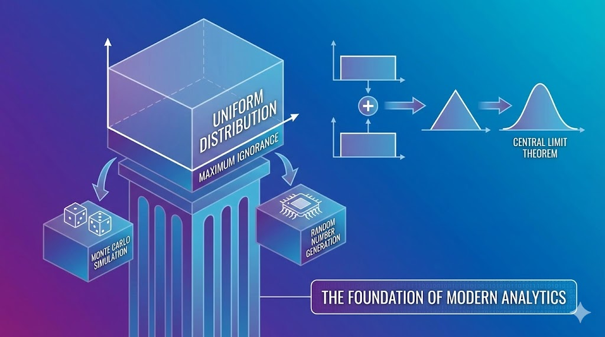

The **Uniform Distribution** is often the first continuous distribution we encounter, and while it looks simple (just a flat "box" between two points), it plays a critical role in engineering and data science.

### When to Use It: The Principle of Maximum Ignorance

In many engineering workflows, we use the uniform distribution when we have "maximum ignorance" about a variable. If you only know the absolute minimum and maximum possible values—but have no reason to believe any value in between is more likely than another—the uniform distribution is the mathematically honest choice.

This makes it a staple in **Monte Carlo simulations**, where we define ranges for uncertain parameters (like reservoir thickness or material strength) to see how they impact our final results.

### The Hidden Complexity: Summing Uniform Distributions

One of the most interesting properties of the uniform distribution is what happens when you combine them. 

If you take two independent uniform distributions with the same range and sum them together, you don't get another "box." Instead, you get a **Triangular Distribution**. This is a specific case of the *Irwin-Hall distribution*. As you keep adding more uniform variables, the resulting sum begins to look more and more like a Normal Distribution—a perfect, hands-on demonstration of the **Central Limit Theorem** in action.

### The Foundation of Everything Else

Did you know that the uniform distribution is the basis for almost every other distribution generated by a computer?

Most algorithms focus on creating high-quality pseudo-random numbers that follow a uniform distribution $U(0, 1)$. Using a technique called **Inverse Transform Sampling**, we can map these uniform values into any other distribution we need (Normal, Lognormal, Poisson, etc.). 

It truly is the starting point for all stochastic modeling. Next time you see that simple flat line, remember that it's the engine driving much of modern analytics!

