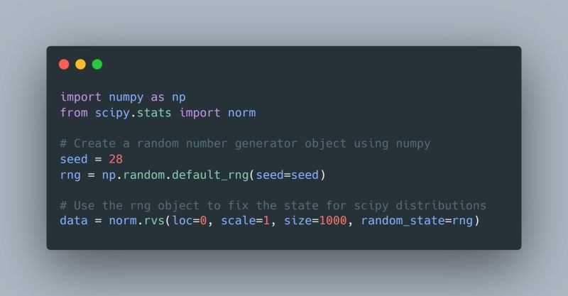

--- 
title: "Ensuring Reproducibility in Statistical Analysis with Seeds"
date: 2024-02-28T18:13:00
draft: false
description: "Learn why using random seeds and RNG objects is critical for making your research and uncertainty analysis findings reproducible."
topics: ["data-science", "best-practices"]
---

Never share your findings without ensuring reproducibility.

Always use a 'seed' 🌱

To ensure reproducibility in statistical analysis, consider leveraging numpy and scipy. If you're using scipy.stats to define random variables for an uncertainty analysis study, be sure to specify a Random Number Generator (RNG) object when calling the .rvs() method to generate samples from your distribution. 

In the example below, I demonstrate creating an RNG object with numpy using a predefined seed number. Then, I import a normal random variable from scipy.stats, define its parameters and include the random_state argument, which references the previously created RNG. 

By establishing a specific starting point (seed) for random number generation, you empower others to replicate the exact conditions of your study. This transparency fosters trust and reliability in scientific discoveries.


