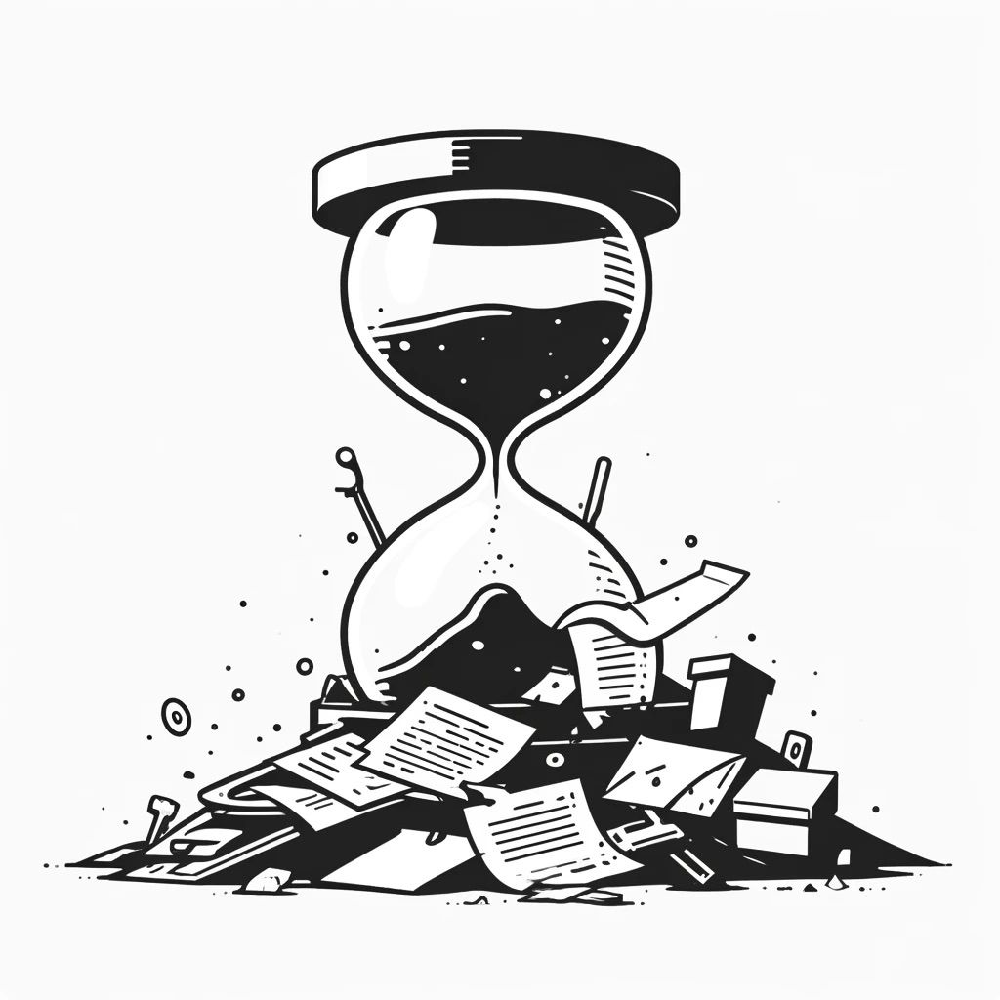

--- 
title: "The Importance of Collaboration Between Data Scientists and Domain Experts"
date: 2024-03-31T17:00:00
draft: false
description: "Avoiding common project failures by ensuring clear communication and shared understanding between technical and business stakeholders."
topics: ["data-science", "opinion"]
---

What's the most effective way to waste time in a data science project?

Put a data scientist to work with a domain expert when they have no idea about the nature of each other's work.

If you are a data scientist, ask/learn from the domain expert. If you are the domain expert, learn the basics of data science.

If you are either of those, learn programming.

It'll make everyone's life easier by aligning the business and technical objectives early on.

Last but not least, make sure it is a "data science" project. Are you sure it can't be solved with existing tools? Don't just fall for the "we have to use AI" trend.

What's your experience in this type of situation?


