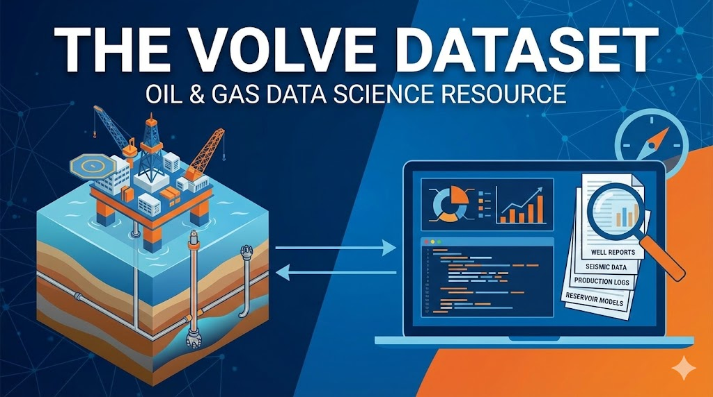

--- 
title: "The Volve Dataset: A Comprehensive Resource for Oil & Gas Data Science"
date: 2024-04-15T18:21:00
draft: false
description: "Why the well-documented Volve dataset is an exceptional choice for testing problem-solving skills in the energy sector."
topics: ["data-science", "tutorial"]
---

When choosing an open dataset for learning or testing new skills, make sure to understand its context.

Here is why the Volve* dataset is one of the best-documented open datasets for O & G.

1. 𝐈𝐭 𝐢𝐧𝐜𝐥𝐮𝐝𝐞𝐬 𝐚 𝐰𝐞𝐚𝐥𝐭𝐡 𝐨𝐟 𝐢𝐧𝐟𝐨𝐫𝐦𝐚𝐭𝐢𝐨𝐧.

- Seismic.
- Production/pressure data.
- Well data (deviation, logs, completion, etc)
- Reservoir model.
- and more...

2. 𝐔𝐧𝐦𝐚𝐭𝐜𝐡𝐞𝐝 𝐜𝐨𝐧𝐭𝐞𝐱𝐭:

The Volve dataset provides an excellent context in operations and planning reports, offering insight into data collection methods and business goals.

3. 𝐀 𝐝𝐞𝐝𝐢𝐜𝐚𝐭𝐞𝐝 𝐰𝐞𝐛𝐬𝐢𝐭𝐞 𝐭𝐨 𝐚𝐧𝐚𝐥𝐲𝐳𝐞 𝐭𝐡𝐞 𝐝𝐚𝐭𝐚𝐬𝐞𝐭.

The discovervolve.com website contains posts on every aspect of the dataset, providing valuable explanations that can save you hours in understanding its contents and potential uses.

Kudos to Ankit Bansal and the other contributors; fantastic work!

--- 

Whenever you want to test your problem-solving skills using data science or programming, use a dataset with good context to understand better whether your solution would work.

Using the Volve dataset is a good step toward more realistic problem-solving.

https://www.equinor.com/energy/volve-data-sharing

* You can find the license agreement of the Volve dataset here: 

https://cdn.equinor.com/files/h61q9gi9/global/de6532f6134b9a953f6c41bac47a0c055a3712d3.pdf?equinor-hrs-terms-and-conditions-for-licence-to-data-volve.pdf


