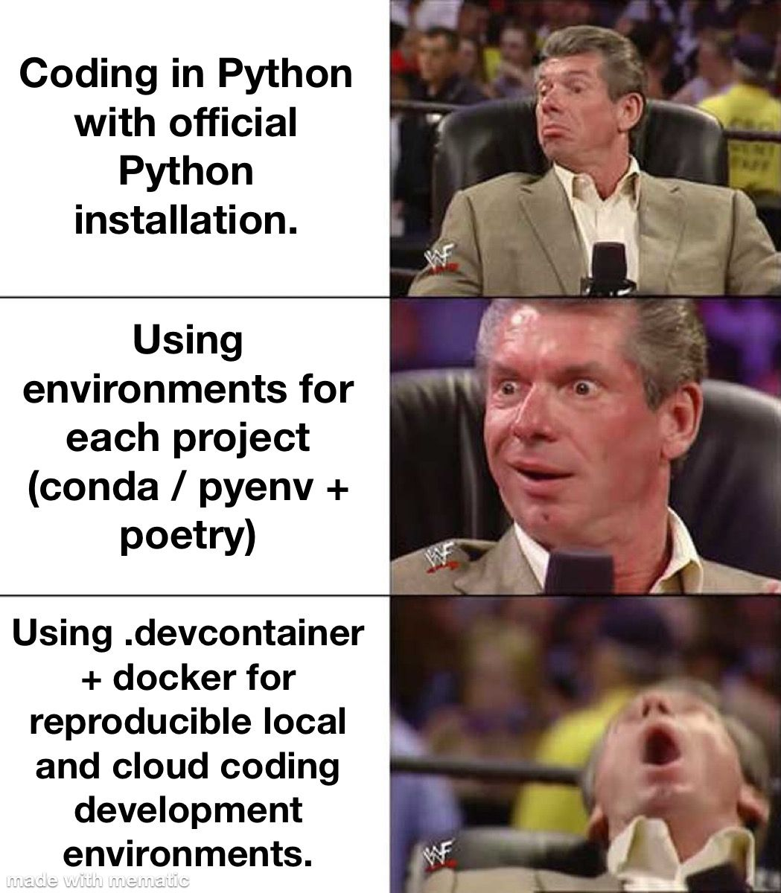

--- 
title: "Dev Containers: Solving the 'Works on My Machine' Problem"
date: 2024-07-10T17:00:00
draft: false
description: "Discover how development containers provide uniform setups, quick starts, and isolated environments for modern coding workflows."
topics: ["python", "dev-containers", "tutorial"]
---

I can't believe I spent so long without using dev containers.

Some problems I struggled with:

❌ cluttered disk with conda and venv environments  
❌ struggled to replicate on different computers  
❌ time-consuming setup  

Here are some advantages of dev containers 👇

⚙️ Uniform Setup.
Everyone on the team uses the same development environment, avoiding setup problems.

🚀 Quick Start.
Launch ready-to-use environments instantly, saving time on installation and configuration.

🤝 Better Teamwork.
Share the same setup with teammates, making it easier to work together.

☁️ Cloud Development.
Use cloud-based IDEs like GitHub Codespaces to access your development environment from anywhere.

I can code on my iPad the same way I do it on the computer!

🔒 Safe and Separate.
Run code in isolated containers, protecting your main system from potential issues.

Comment below if this sounds like something you'd like to try. I might post instructions on how to set it up.


