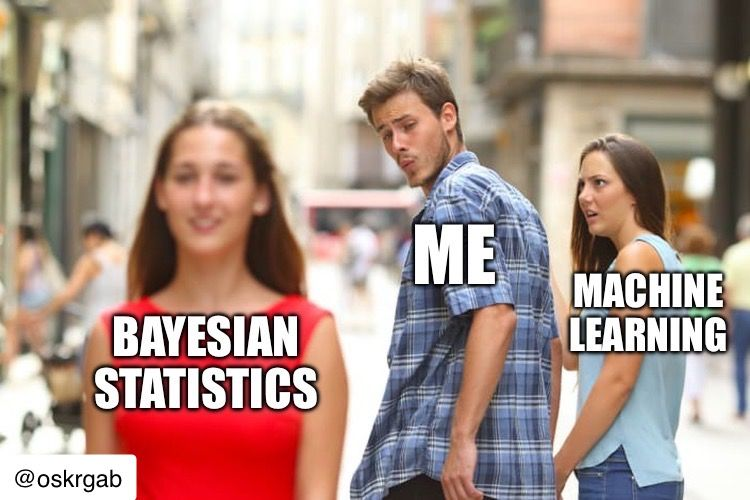

--- 
title: "5 Reasons to Embrace Bayesian Statistics for Real-World Problems"
date: 2024-07-30T17:00:00
draft: false
description: "Exploring the benefits of Bayesian modeling, from handling limited data to incorporating expert knowledge through priors."
topics: ["bayesian-statistics", "statistics", "opinion"]
---

Why I'm Falling for #Bayesian Statistics…

- Clear assumptions stated in the model through DAGs and priors.
- Ability to work with limited data while still yielding reasonable results.
- Incorporation of expert knowledge by defining priors and parameter relationships.
- Results presented as distributions (posterior).
- Easy model updates with new data.

Take a look at it, you won’t regret it.


