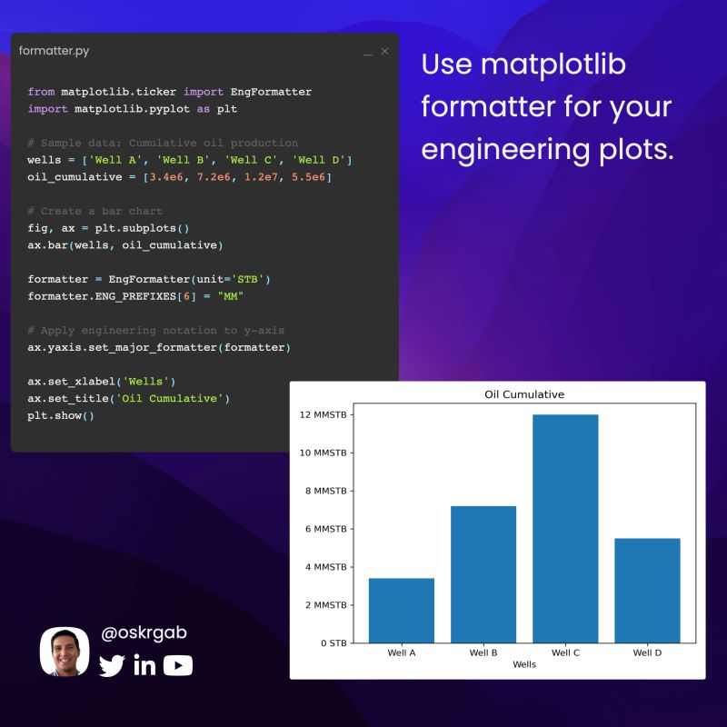

--- 
title: "Formatting Engineering Units on Matplotlib Axis Labels"
date: 2024-08-19T17:00:00
draft: false
description: "Learn how to use Matplotlib's EngFormatter to cleanly display scientific notation and powers of 1000 on your plots."
topics: ["python", "data-visualization", "units"]
---

Do you struggle with units in your axis labels?  So did I...

Sometimes I found myself multiplying the values in my data just to rely on matplotlib to render the right scientific notation. Instead of changing your data, just format the plot using a Formatter object. 

My favorite is the EngFormatter which will format the labels in engineering notation to represent powers of 1000.

Below is a quick example on displaying oil cumulatives, which are usually rendered in thousands or millions.


