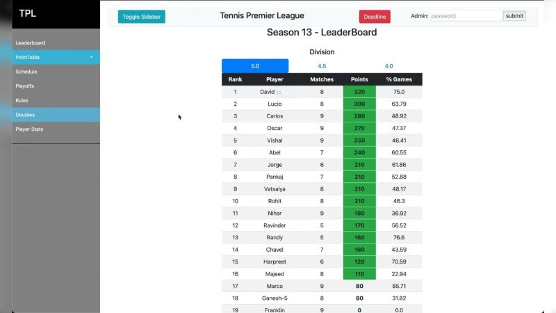

--- 
title: "Hosting Your Python Web Apps with PythonAnywhere"
date: 2024-10-21T23:00:00
draft: false
description: "A quick look at a convenient platform for deploying small-scale Python projects, and how to combine your hobbies with coding."
topics: ["python", "web-development", "cloud"]
---

Have you ever heard about www.pythonanywhere.com? It is a hosting platform for Python web apps. It's ideal for small-scale projects and even offers a free tier for developing and deploying web applications.

Speaking of projects, I play in a local tennis league called TPL. The organizers have created a website to track scores, schedules, and leaderboards: https://lnkd.in/eApU2pTk

Have you tried combining your favorite hobby with coding? Tell me about it!


