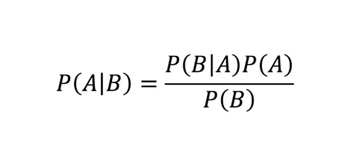

--- 
title: "Top Free Resources for Learning Bayesian Statistics"
date: 2024-10-24T23:00:00
draft: false
description: "A curated list of books, videos, and podcasts to help you master Bayesian modeling using tools like PyMC and Stan."
topics: ["bayesian-statistics", "statistics", "machine-learning"]
---

If you like statistics and machine learning, you'll enjoy Bayesian Statistics.

Check out some of the best FREE resources to start learning:

- Statistical Rethinking: This is the best resource I've found so far. It starts with the fundamentals, and the code examples are in R and Stan. The accompanying book is available on Amazon too.
  
📹 Videos: (https://lnkd.in/e5fmjEW4)

- Bayesian Modeling and Computation in Python (Online Book): Another great resource with examples using PyMC in Python. 

📙Read it here: https://lnkd.in/eJ5hV93E

- Learning Bayesian Statistics (Podcast): If you're interested in hearing about use cases, expert insights, and real-life applications of Bayesian Statistics, check out this podcast. 

🔉Listen here: https://lnkd.in/eKRFW2v6

Let me know what you think of these resources, and comment below if you know of any others we can all learn from!


