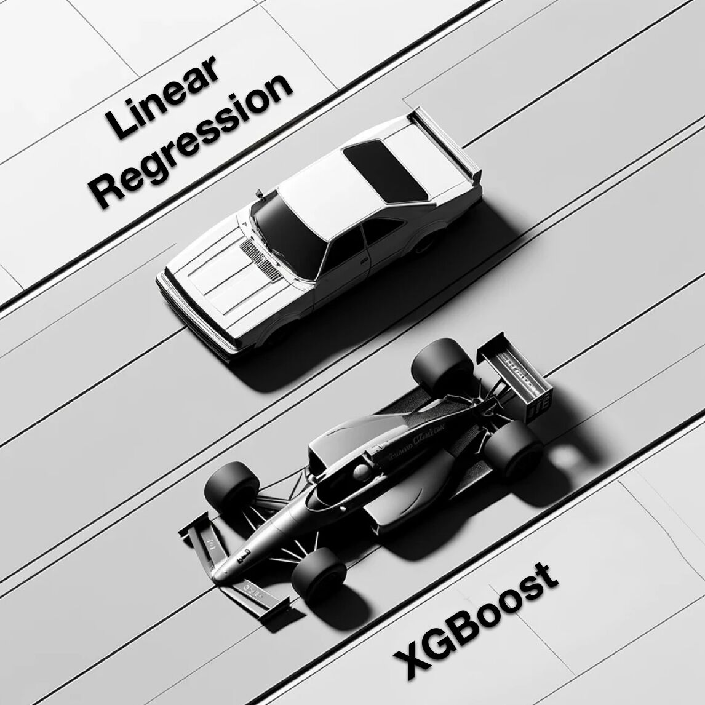

--- 
title: "The Essential Role of Baseline Models in Machine Learning"
date: 2024-10-28T22:30:00
draft: false
description: "Why you should always start with simple regressors before jumping into complex algorithms to accurately judge your model's performance."
topics: ["machine-learning", "tutorial"]
---

Don’t Skip Baseline Models in Regression.

Data scientists often jump to complex models like XGBoost without checking prediction quality. MSE scores are common, but without a baseline, it's hard to judge their effectiveness.

Start with baseline models before diving into complexity:

• Mean Regressor: Predicts the average value of your target variable, giving you a basic reference point.

• Linear Regression: Simple, interpretable, and often a solid benchmark.

If your advanced model doesn’t significantly outperform these, you’re likely overfitting or over-engineering the problem. Always compare your results to baseline models first—complexity isn’t always better.


