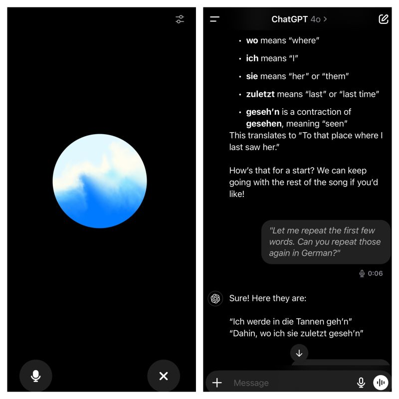

--- 
title: "Language Learning with ChatGPT's Advanced Voice Mode"
date: 2024-10-30T23:00:00
draft: false
description: "Exploring an unconventional but highly effective method for learning new languages by analyzing song lyrics and practicing pronunciation with AI."
topics: ["ai-tools", "chatgpt", "opinion"]
---

My favorite use of the advanced voice mode in ChatGPT so far: learning a new language with the lyrics of songs you like.

My prompt: “I want to learn German by understanding the lyrics of ‘Ohne dich’ by Rammstein. Explain the meaning of each word and correct my pronunciation.”

You can interrupt anytime to adjust speed, making it user-friendly. Easily revisit sections if you forget something. It also offers helpful pronunciation tips, focusing on areas needing improvement.

I don’t know if this is the best or worst method to learn a new language, but I can tell you this… 

It’s so cool to sing along the song in the car with reasonable pronunciation and actually understand what it means! 

Give it a shot and let me know what you came out with!


