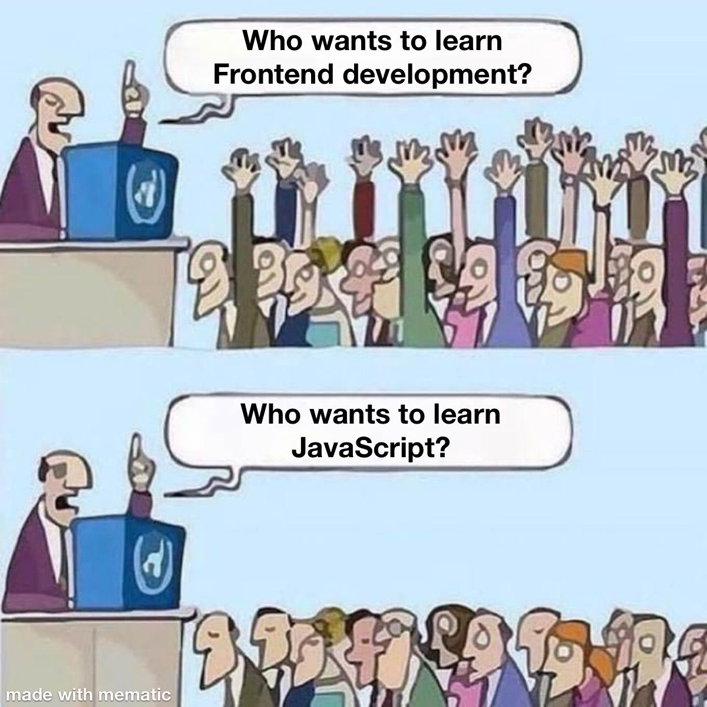

--- 
title: "Choosing a frontend stack: Python, React, or HTMX?"
date: 2024-11-04T23:00:00
draft: false
description: "Exploring the dilemma faced by scientific developers when choosing between traditional JavaScript frameworks and modern alternatives like HTMX."
topics: ["python", "web-development", "opinion"]
---

DS/Scientific/Python devs often avoid JavaScript. 

I tried it and didn’t like it. 

A friend said #React is all I need, and while I'm considering #htmx, React’s maturity and online resources are appealing. 

#Python devs, what do you choose for #frontend development?


