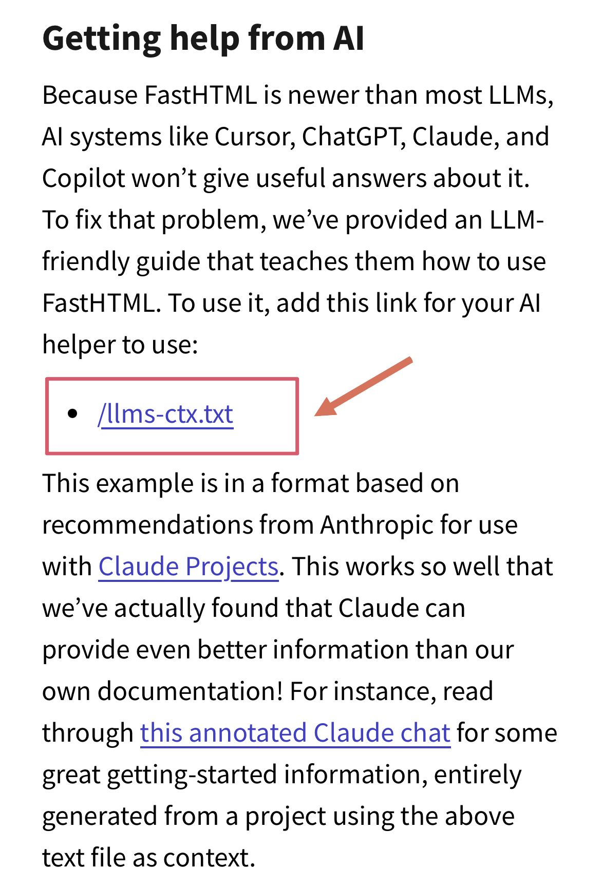

--- 
title: "LLM-Friendly Documentation: A New Standard for Library Authors"
date: 2024-11-07T18:00:00
draft: false
description: "How libraries like FastHTML are improving the developer experience by providing documentation optimized for AI coding assistants."
topics: ["ai-tools", "programming", "opinion"]
---

Programming has definitely changed with the help of LLMs and systems that implement them like #Cursor and #Copilot. Efficiency has increased as long as you are the one in control. 

A common problem with using these assistants is that they are sometimes outdated and are unaware of the latest packages or documentation updates.

Given my recent interest in Frond End development, I was looking into FastHTML, a #Python library for building web apps based on #htmx. When I looked at the documentation, I found this gem 👇. 

How great that the authors provide LLM-friendly documentation! Providing information this way can be very productive from the beginning if you use #Cursor or #Copilot in your IDE. 

Even though most libraries have good documentation, sending the webpage often has insufficient context to the #LLM to give you good answers.

Kudos to the #FastHTML team for it!
Docs: https://docs.fastht.ml/


