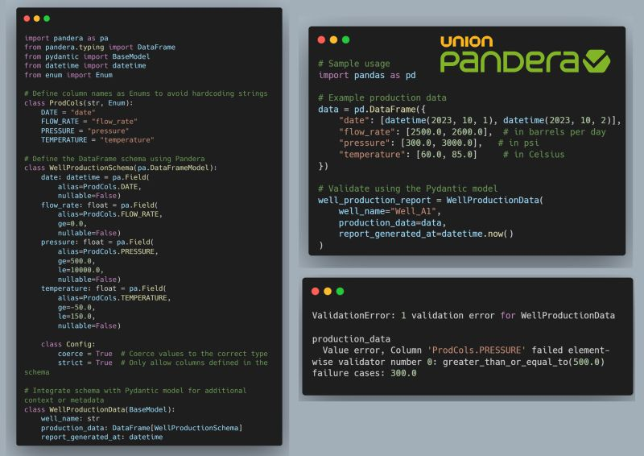

--- 
title: "Reliable Data Validation with Pandera and Pydantic"
date: 2024-11-14T22:43:00
draft: false
description: "Learn how to use dataframe schemas to enforce column naming, value ranges, and overall data integrity in your Python projects."
topics: ["python", "pandas"]
---

Everyone loves #dataframes. They are easy to handle and understand when dealing with tabulated data. However, using them to pass data between objects or the #backend and #frontend can be challenging.

- How do you ensure the naming of your columns is consistent?
- How can you check if a column's values fall within a specific range?
- Do you allow NaN values?

Scattering checks throughout your code make it difficult to maintain and prone to errors.

This is why I've been using #Pandera for the past year.

Pandera has enabled me to create Dataframe Schemas that serve as blueprints for how my dataframes should be structured, with the added benefit of validating them simultaneously.

My favorite feature is its integration with #Pydantic Models (a well production schema 🛢️example 👇). The output of this code raises a ValidationError since one pressure point is outside the allowed range (500 <= pressure <= 1000)

The code remains clean and maintainable, allowing you to define all necessary constraints.

Let me know if you tried it already!


