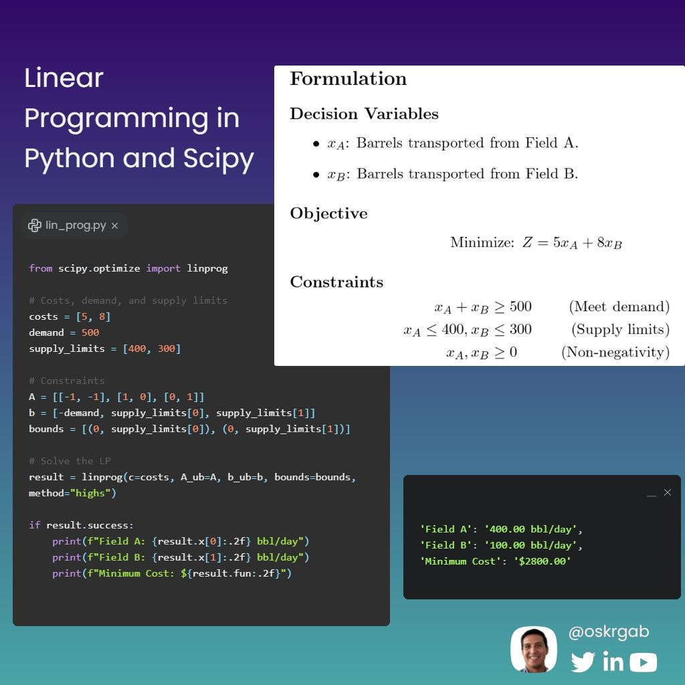

--- 
title: "The Power of Linear Programming for Engineering Optimization"
date: 2024-11-19T00:00:00
draft: false
description: "Discover why LP is an underutilized but powerful tool for logistics and resource allocation, with a practical example in SciPy."
topics: ["optimization", "tutorial"]
---

In the age of machine learning, linear programming (#LP) often goes unnoticed. It’s rarely emphasized in some engineering curricula, and unlike #ML, #LP requires you to formulate the problem yourself—defining the objective, constraints, and relationships. 

This makes it feel less “automated” and perhaps more intimidating. 🤔

But here’s the truth: LP is a powerful, underutilized tool. It’s simple, fast, and directly applicable to real-world engineering challenges where optimization is critical. 💪

A Simple Example: Crude Transportation

Suppose you have:

• Two oil fields (A and B) supplying crude to one refinery (X).
• Field A can supply up to 400 barrels/day for $5/bbl.
• Field B can supply up to 300 barrels/day for $8/bbl.
• The refinery demands 500 barrels/day.

Goal:
Minimize transportation costs while meeting the refinery’s demand. 🚚💰

Check the image below 👇 with the formulation and the code in #scipy.
-----------------------

Unlike ML, LP gives exact solutions to well-defined problems, making it perfect for logistics, production planning, and resource allocation. Yes, you have to think upfront to formulate the problem. Once you master it, LP can transform how you approach engineering challenges. 🌟


