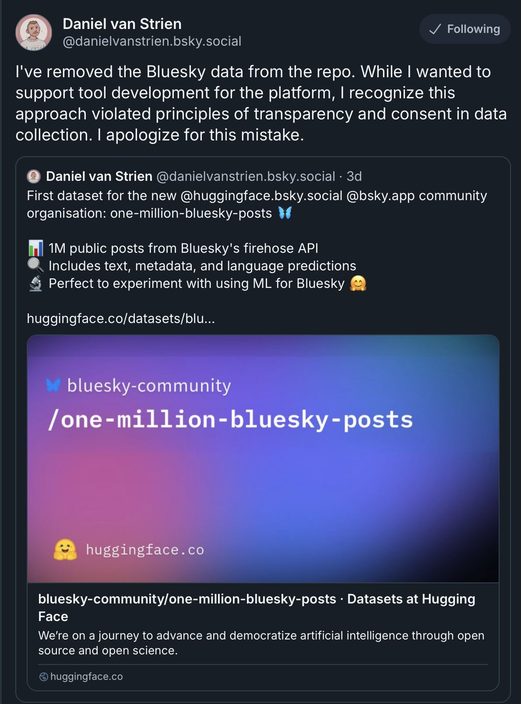

--- 
title: "Data Privacy and User Consent in the Age of Open Protocols"
date: 2024-11-29T17:54:00
draft: false
description: "Reflections on a recent debate over social media data scraping and what it means for individual content ownership and privacy."
topics: ["data-science", "opinion"]
---

There is an interesting discussion on Bluesky about data collection and user consent for using that information.

People were outraged when someone collected and published 1 million Bluesky posts on Hugging Face for experimental and research purposes.

This anger starts from users not having given consent for their information (posts, usernames, etc.) to be used for any purpose. According to Bluesky's Terms of Service (link in the comments), users own their content and can request its deletion. 

However, there is no guarantee of deleting content accessed through the AT Protocol, as it is open and anyone can access your posts. It's a reminder that even if data is not publicly accessible on all platforms, most, if not all, will use your data for their benefit.

The person who scraped and uploaded the information to Hugging Face posted the dataset on Bluesky, so people were aware of it, which is when the discussion started. I don't think he deserves all this rage tbh; it reminded everyone that their data is public.

It's likely that big companies are using your data regardless of consent (you agree to this when signing up on their platform), and even selling products based on it.

Are you aware of your data being used in this way? Do you agree with it? 

P.S. In case you haven't seen them already, there are a couple of Netflix documentaries about user data in social media platforms:

- The Great Hack
- The Social Dilemma


