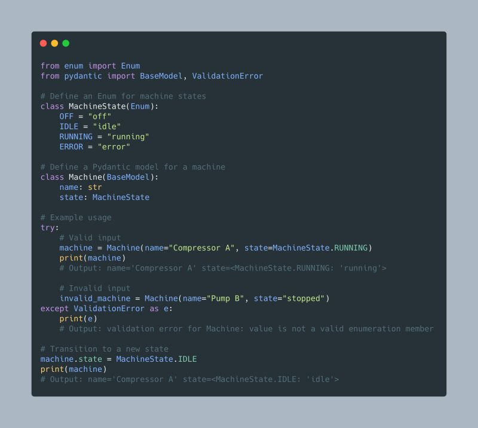

--- 
title: "Better Code with Python Enums: Readability, Safety, and Immutability"
date: 2024-12-04T18:00:00
draft: false
description: "Learn the benefits of using Enums to replace magic numbers and improve validation in your Python and Pydantic models."
topics: ["python", "tutorial"]
---

Enums in Python are one of those objects that are often overlooked by self-taught developers but actually really useful!

Here are some benefits:

📖 Improved Readability: use descriptive names instead of hardcoded values
🚫 Avoid Magic Numbers: replace arbitrary values with meaningful names
⚖️ Type-safe Comparisons: different enums or invalid values raise errors
🔒 Immutable: enum members are constants, preventing reassignment

Besides, they work great with Pydantic, as it automatically enforces the valid values for the attribute. I personally also use them to define column names for Pandera schemas.

Key Points in the example below:

1️⃣ Enum States: MachineState specifies valid states (OFF, IDLE, RUNNING, ERROR) clearly.
2️⃣ Pydantic Validation: Ensures the state is one of MachineState's values.
3️⃣ Type-Safe Transitions: Only allows setting valid states.

So the next time you find yourself define constants everywhere without context, creating magic numbers, and using them as valid input to your classes, remember to have a look at Enums, the'll simplify your life in the long run.


