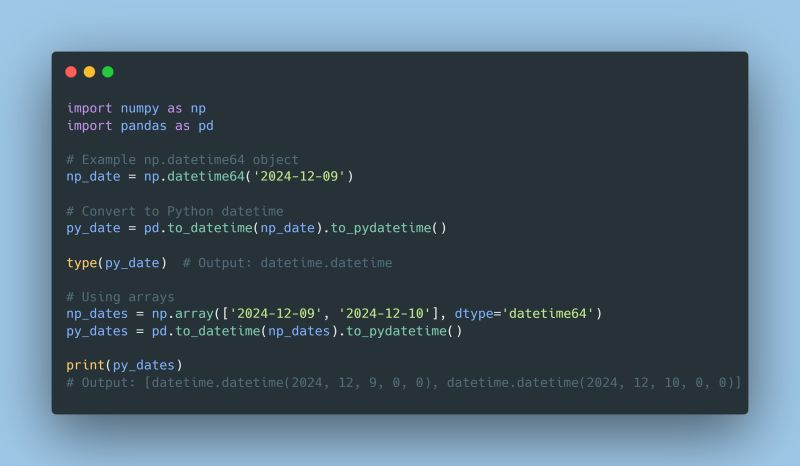

--- 
title: "Handling NumPy Datetime Serialization for Frontend Integration"
date: 2024-12-09T18:00:00
draft: false
description: "Best practices for converting internal scientific data types to standard formats before exposing them to views or external APIs."
topics: ["python", "numpy", "tutorial"]
---

I often run into np.datetime64 objects when working with scientific computing in Python, especially time-series analysis (oil production vs. time). While NumPy is great for calculations, these objects can be a pain when it comes to sharing data with the frontend or other systems.

Here’s why: np.datetime64 isn’t easy to serialize. If you’ve ever tried sending it as part of a JSON response or using libraries like #Pydantic, you’ve probably run into errors. Frontend developers can’t use data they can’t parse, creating unnecessary back-and-forth.

To avoid this, I make it a habit to convert np.datetime64 objects to Python’s standard datetime before exposing the data and Pandas makes this easy.

In a straightforward MVC design (Model-View-Controller) the conversion to #Python datatimes occurs in the controller, not in the model, since I want my business logic to stay optimized using #numpy and only gets converted to datetime before going to the View (FrontEnd)

Give it a try if you've run into this problem before!


