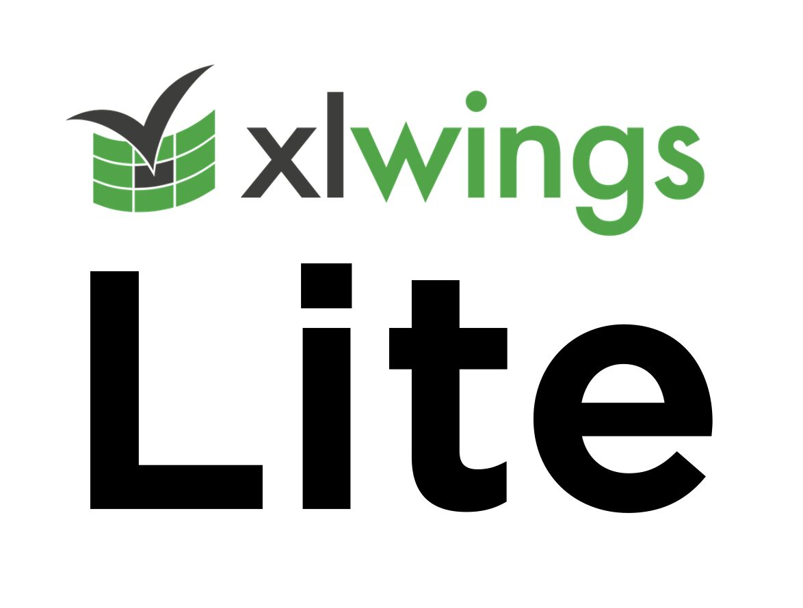

--- 
title: "Meeting Users in Excel: The Power of xlwings and Pyodide"
date: 2024-12-10T20:22:00
draft: false
description: "Discover how tools like xlwings allow developers to build powerful applications with an Excel frontend, enhancing productivity for non-programmers."
topics: ["excel", "opinion"]
---

I've always thought you should meet your users where they are the most productive. Excel is one of those tools where people are/feel productive, especially for those with no programming background.

xlwings is a tool that allows developers to do precisely this: build applications with an #Excel frontend. Now, using Pyodide, the possibilities are endless since you can start developing without thinking about your server architecture.

Awesome stuff Felix Zumstein!!


