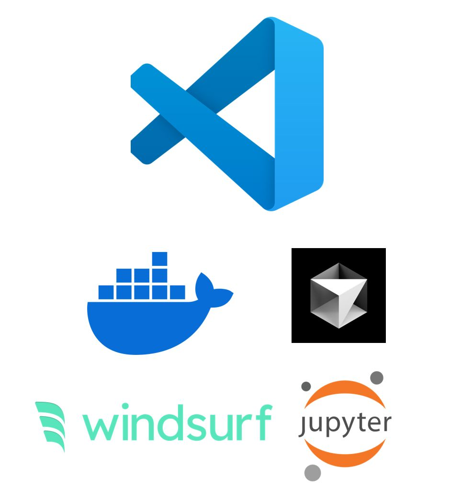

--- 
title: "Switching from PyCharm to VSCode: 5 Reasons for the Change"
date: 2024-12-11T23:00:00
draft: false
description: "Reflecting on my journey from a professional IDE to a lighter, community-driven setup and the benefits of modern AI extensions."
topics: ["python", "ide", "opinion"]
---

A lifetime PyCharm user goes back to VSCode...

📌 Here are 5 reasons that made me switch:

1️⃣ It's 100% free

2️⃣ Because it's free, chances are that your colleague are also using it. Most of the It's easier to collaborate on software projects with VSCode 

3️⃣ Jupyter Notebook support / Interactive mode support (similar to PyCharm's Scientific Mode)

4️⃣ AI Code assistants are here to stay, Cursor and Windsurf are based on VSCode, so there is little friction when you start using one of them if you've been using VSCode already.

5️⃣  devcontainer support. This is becoming a standard for a reproducible dev environment, both locally and in the cloud. Set it up once, enjoy everywhere. No more manual environment installations, extension installs, etc when changing computers/working in the cloud. PyCharm professional supports Docker, but you have to pay for it.

--------------------------------------

Some background:

I started learning Python (about 9 years ago) as pretty much every analytics/scientific computing guy. Coming from Matlab, I used Spyder and Jupyter notebooks most of the time.

But as I kept learning Python, these tools were not enough. At the time, Jupyter notebooks had bad support for diffs or version control, and even when Spyder supported VCS, it felt a bit clunky, lacking interaction and advanced refactoring options.

This is when PyCharm came along. It is still one of my favorite IDEs, easy to setup run configurations, support for creation of different environments (conda, venv, etc), embedded git UI, and great refactoring options. 

I had the fortune to have PyCharm Professional Edition, and I could keep using my old notebooks, but I also loved the Scientific Mode, which allows you to run "cells" in a .py file, see interactive output in a separate pane, variable inspection support, and dedicated plot pane.

Unfortunately, most of the features I used came with the Professional License. Since I was also mentoring other colleagues in Python, I couldn't ask everyone to buy a JetBrains subscription. So, I had to try VSCode.

I've got to say I didn't like it at the beginning. It took me a while to get a setup similar to my one in PyCharm, but I got there in the end and now I feel very productive in VSCode as well.

P.S. Are you using VSCode or PyCharm? Where do you feel the most productive and why? I'm currently using Cursor!


