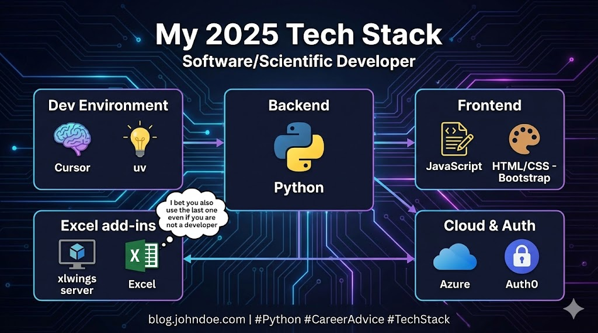

--- 
title: "My 2025 Tech Stack: Python, Cursor, UV, and Beyond"
date: 2025-05-13T17:39:00
draft: false
description: "A comprehensive look at the tools and frameworks I use daily for scientific development and software engineering."
topics: ["python", "career-advice", "opinion"]
---

My current tech stack as Software/Scientific developer:

(I bet you also use the last one even if you are not a developer)

Dev environment:
🧠 Cursor
💡 uv

Backend:
🐍 Python

Frontend:
📝 Some JavaScript
🎨 HTML/CSS - Bootstrap

Cloud
☁️Azure

Authentication
🔐Auth0

Excel add-ins:
🖥️ xlwings server
📊 Excel (duh)

Which of these are you using? And for what purpose?


