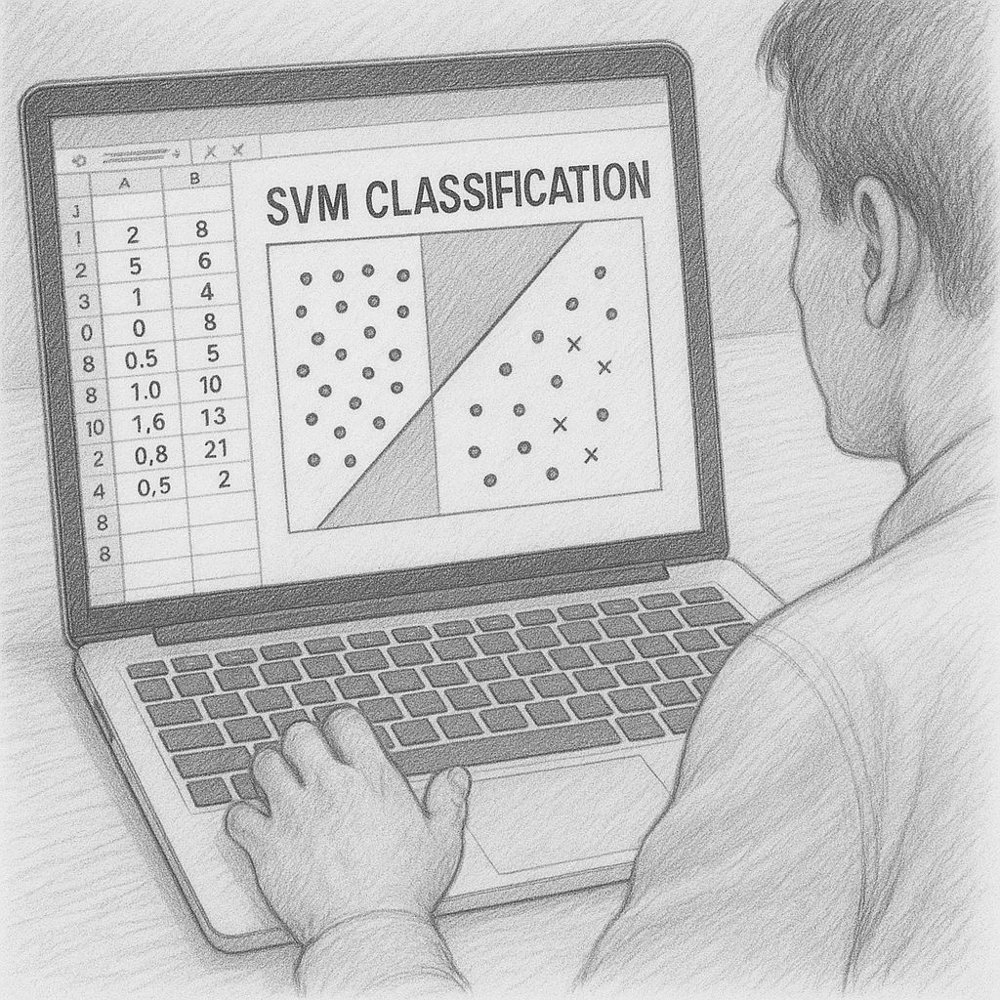

--- 
title: "Why Basic Machine Learning Still Matters in the Age of LLMs"
date: 2025-05-14T17:00:00
draft: false
description: "Exploring why statistical fundamentals and local ML tools are still essential for high-quality data analysis."
topics: ["python", "beginner-friendly", "opinion"]
---

Despite all the LLM hype, I truly think it's worth learning basic Machine learning.

If you have a small dataset in Excel, start learning the basics of ML to elevate your statistical analysis and provide greater insights. 

One easy way to start if you already know Python, is to use xlwings lite free add-in from @felixzumstein inside Excel. It'll allow you to use scikit-learn, pandas, polars, etc completely offline and without complicated setups.

And if Python is not your thing and you just want to deal with regular Excel formulas while still doing Machine Learning, I am working on something that might interest you.

Let me know if you want to know more, since I’ll start beta testing shortly.


