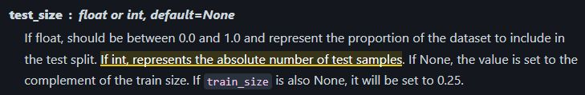

--- 
title: "Python Tip: Precise Control over Scikit-Learn Train-Test Splits"
date: 2025-05-16T17:00:00
draft: false
description: "A quick reminder on why it's always worth reading the documentation for even the most familiar machine learning functions."
topics: ["machine-learning", "python"]
---

Despite using train_test_split for some time now, I just realized you can specify an integer to the "test_size" argument of this function to specify the exact number of samples you want to get as your test size.

Those little things you learn when you actually read the documentation 🫠


