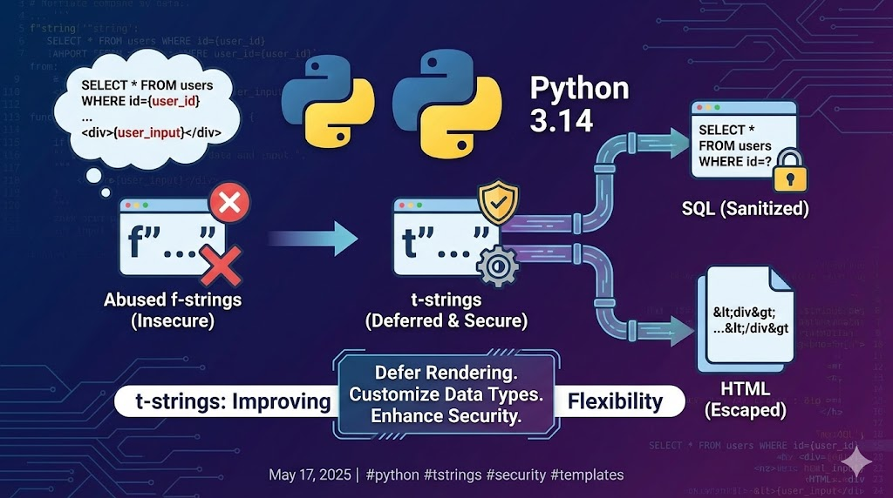

--- 
title: "Python 3.14 t-strings: Improving Template Security and Flexibility"
date: 2025-05-17T17:00:00
draft: false
description: "How the new t-string prefix helps prevent common issues with string formatting for SQL, HTML, and other templates."
topics: ["python", "tips"]
---

t-strings in #python. Because so many abused f-strings to write SQL and HTML 😅.

Still a nice addition to Python 3.14 to improve on flexibility and security.

The main idea is that you defer the rendering of the string, so you can customize the different data types that you have in your "template" object (which is the immediate result of the t-string)


