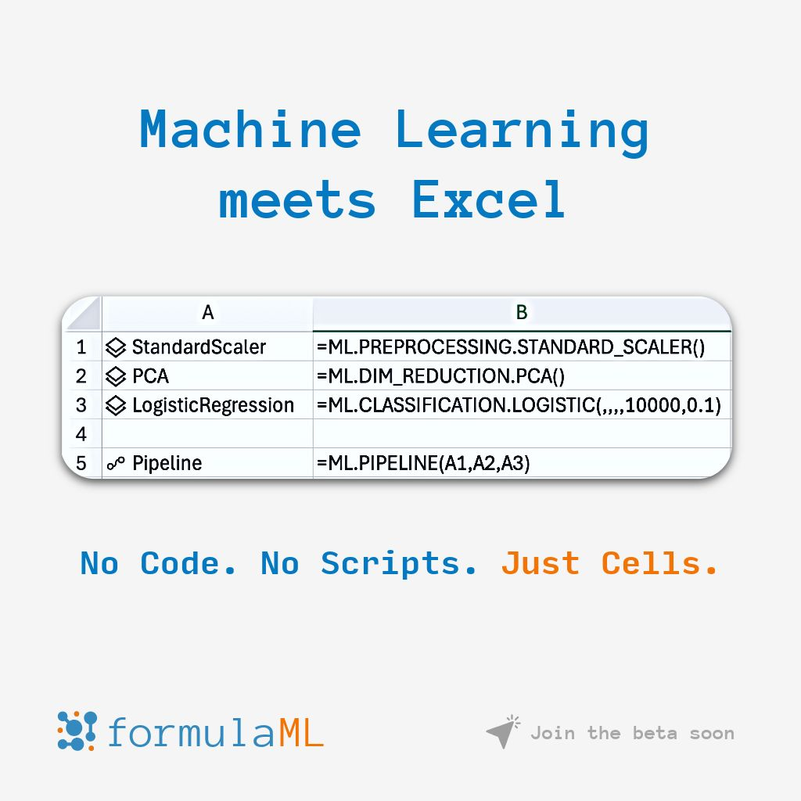

--- 
title: "formulaML: Bringing Machine Learning Directly to Excel Formulas"
date: 2025-05-27T17:04:00
draft: false
description: "Introducing a new tool that allows analysts to build ML pipelines and run predictions without leaving their spreadsheets."
topics: ["machine-learning", "excel", "formulaml"]
---

🚀 Machine Learning in Excel?

formulaML is my attempt to bring Machine Learning where people feel most confortable with and where their data already resides - Spreadsheets and using what they already know = formulas.

📊 No Python. No IDE. Just Excel formulas.

👇 Take a look at this syntax:

🔹 =ML.PREPROCESSING.STANDARD_SCALER()
🔹 =ML.DIM_REDUCTION.PCA()
🔹 =ML.CLASSIFICATION.LOGISTIC(,,,10000,0.1)
🔹 =ML.PIPELINE(A1,A2,A3)

💡 What’s going on here?

✅ Each cell defines a step in your ML pipeline
✅ You reference steps by cell, just like formulas
✅ No code. Just plug-and-play modeling
✅ Scikit-learn power, Excel simplicity

Perfect for:
-  Analysts who want ML superpowers
-  Excel power users tired of exporting data
-  Educators & students learning ML workflows
-  Teams that live in Excel but dream in models

#Excel #MachineLearning #NoCode #AI #DataScience #FormulaML

Coming soon.
🔗 Beta testing starting soon -> Check the link in the first comment 👇


