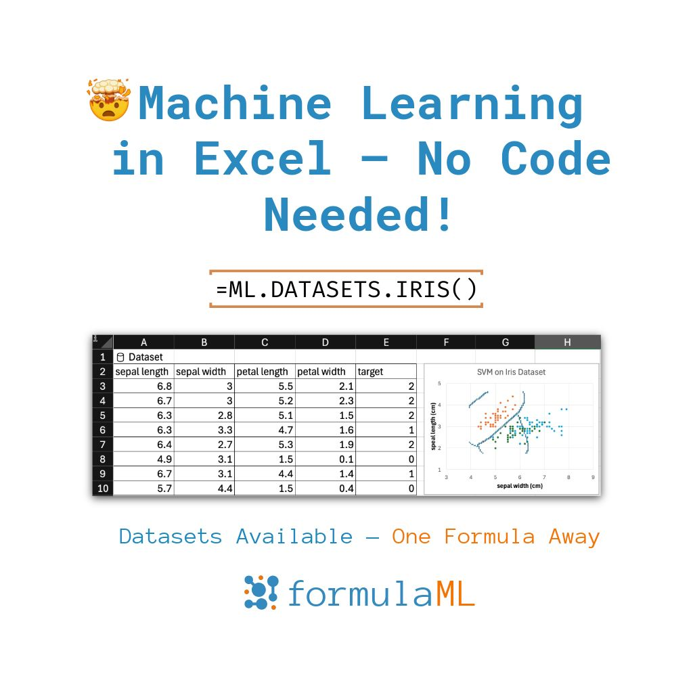

--- 
title: "Exploring Dataset Integration in formulaML"
date: 2025-05-30T17:00:00
draft: false
description: "Learn how to use formulaML to easily access and test classic datasets like Iris and Diabetes directly in Excel."
topics: ["general"]
---

Another feature of #formulaML is that you can plug and play datasets to quickly test and learn new algorithms.

✅ Try formulaML if you want to: 

✔ Implement ML without writing code 
"✔ Access classic datasets in seconds

"✔ Start understanding predictive modeling

📩 Join the beta now   — in the first comment

 Just one formula like:
"🌿 =ML_DEV.DATASETS.IRIS() – the classic classification dataset

"🩺 =ML_DEV.DATASETS.DIABETES() – numeric health data for regression practice

🌐 =ML_DEV.DATASETS.FETCH_OPENML("your_dataset") – connect to thousands of datasets via OpenML

#Excel #MachineLearning #ML #NoCode #AI #DataScience


