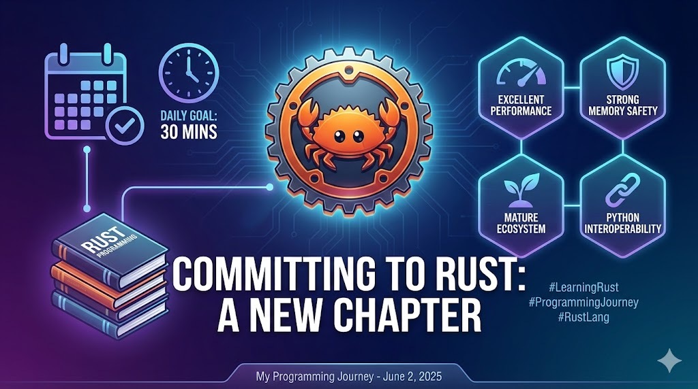

--- 
title: "Committing to Rust: A New Chapter in my Programming Journey"
date: 2025-06-02T17:00:00
draft: false
description: "Exploring the reasons for learning Rust, from memory safety to performance, and setting a daily learning goal."
topics: ["rust", "career-advice"]
---

I've been glancing at #Rust for a while, but now it's time to commit and learn it properly.

Why learn Rust? Here are a few points that caught my attention as an outsider:

🔄 Excellent performance and speed
🛡️ Strong memory safety
🌱 A mature and growing ecosystem
📚 Comprehensive documentation and community support
🔗 Libraries available for interoperability between Rust and #Python (e.g., creating Rust libraries and using them within Python)

I know the learning curve can be challenging, but I'm excited to dive into a new programming language.

This post serves as my commitment to dedicate at least 30 minutes each day to learning Rust—even if it sometimes means just reading the book.

I'll keep you posted on my progress and discoveries along the way.

#LearningRust #ProgrammingJourney #RustLang


