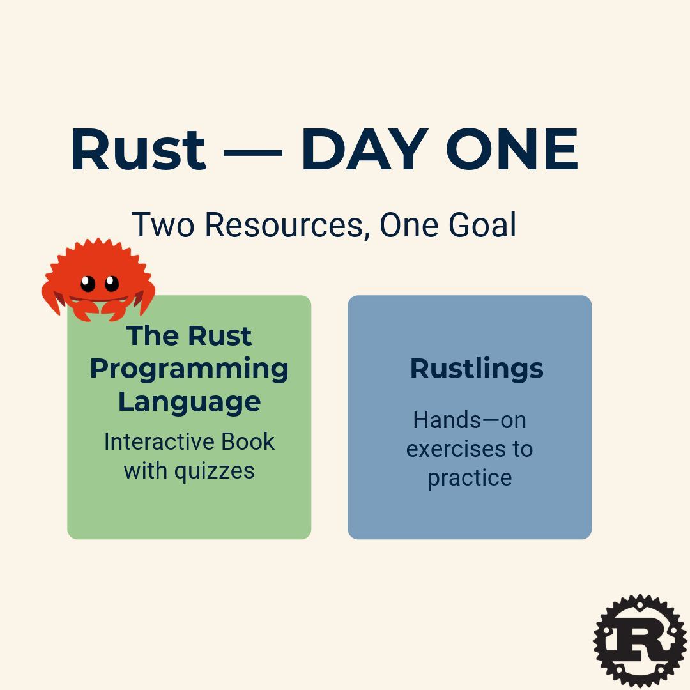

--- 
title: "Learning Rust Day 1: Choosing My Resources"
date: 2025-06-03T17:30:00
draft: false
description: "Setting the foundation for my Rust journey with the official book and the Rustlings exercise library."
topics: ["rust", "tutorial"]
---

#LearningRust Day 1

I searched Google "What's the best way to learn #Rust". After spending about 10 minutes searching across different sites and Reddit posts, I'll focus on using two resources:

- The Rust Programming Language
- Rustlings

The first resource is the official documentation, which is the recommended starting point for learning Rust. I checked other suggestions for books, but I just want to keep my scope as minimal as possible (I'll use the interactive version - the one with quizzes)

The second resource, "Rustlings," is a Rust library that sets up a repository with small exercises to practice what you learn from the book. I was surprised to see that this type of resource exists for Rust, as I hadn't been aware of anything similar for Python.

Kicking off tomorrow with Rust and Rustlings installation!


