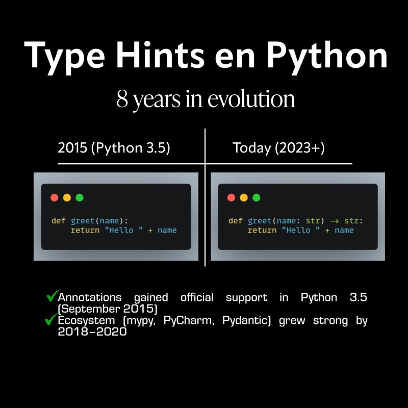

--- 
title: "The Evolution of my Perspective on Python Type Hints"
date: 2025-06-11T17:30:00
draft: false
description: "Why something that once seemed optional has become essential for writing clear and maintainable scientific code."
topics: ["python", "type-hints", "opinion"]
---

When I started with Python, type hints were just this “new thing” in the docs.
No one used them and since Python is a dynamically typed language, why they even existed? Just write your code and it runs.

But after years of writing scripts, debugging, and coming back to my old code without understanding what I meant at the time I wrote it...
Yeah — type hints started to make a lot more sense.

They don’t make your code longer — they make it clearer.
They help your editor help you.

And they catch dumb mistakes before they break things.

I still don’t use them everywhere. But now, when I don’t see them in a project, it actually feels harder to read.

Funny how something that seemed “meh” in 2015 became something I rely on all the time.

#Python #TypeHints #CleanCode #SoftwareEngineering


